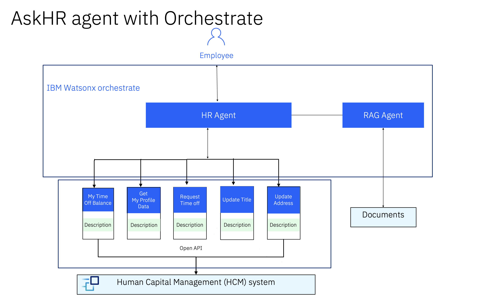

# 🧑‍💼 AskHR

Um dos principais desafios enfrentados por qualquer grande organização é a gestão das operações de RH. À medida que as empresas crescem, torna-se cada vez mais difícil obter informações rapidamente e executar tarefas com facilidade. Com o advento dos sistemas Agentes e o poder dos modelos de raciocínio, torna-se mais fácil ter um único ponto de entrada para realizar praticamente todas as operações de RH.

## 🤔 O Problema

A TechCorp Inc., uma líder global em TI com uma força de trabalho de 100.000 funcionários, enfrentou um grande desafio na gestão de suas crescentes operações de RH. À medida que a empresa se expandia, ela teve dificuldades para lidar eficientemente com os dados de perfil dos funcionários, solicitações de folga e gestão da força de trabalho. Os sistemas de RH tradicionais já não eram suficientes para acompanhar a escala e complexidade. Com várias ferramentas de fornecedores sendo usadas para diferentes operações de RH, torna-se difícil integrá-las todas e oferecer uma experiência fluida ao usuário.

## 🎯 Objetivo

Com este caso de uso, planejamos enfrentar o desafio adotando uma plataforma de nível empresarial, o watsonx, equipada com capacidades Agentes.  
Neste laboratório, veremos como as ferramentas pré-construídas do watsonx Orchestrate podem se conectar a ferramentas de gestão de RH como Workday, SuccessFactors etc., ou criar ferramentas personalizadas para se conectar facilmente a esses sistemas. Com insights orientados por agentes, vamos ajudar a TechCorp a acelerar a recuperação de informações, reduzir a sobrecarga administrativa e garantir uma força de trabalho mais eficiente e eficaz.

## 📈 Valor de Negócio

O uso de um sistema com suporte de IA para otimizar o processo de RH pode ter impactos multidimensionais, como tempo de resolução mais rápido, maior satisfação do usuário, aumento da receita e redução da exaustão dos funcionários, o que, em última análise, impacta positivamente o valor do seu negócio. Por outro lado, aproveitar as capacidades Agentes trará seu próprio conjunto adicional de valores, como maior segurança de dados e respostas mais fundamentadas, sem alucinações, melhorando assim a experiência da marca.

## 🏛️ Arquitetura

Para simplificar as interações dos funcionários com os sistemas de RH, projetamos um agente AskHR orientado por IA usando o IBM watsonx. Esta solução aproveita um modelo de orquestração multiagente que garante raciocínio inteligente, execução de ações fluida e uma experiência responsiva para os funcionários. A arquitetura é construída com o watsonx Orchestrate, permitindo que o agente de RH gerencie uma ampla gama de consultas e solicitações relacionadas a RH de forma eficiente.

#### Capacidades principais do agente AskHR:

1. Automatiza tarefas rotineiras de RH, como verificar saldo de folgas, solicitar tempo livre e atualizar dados dos funcionários.

2. Permite interação natural entre os funcionários e os sistemas de RH de backend por meio de uma interface de aplicativo intuitiva.

3. Usa raciocínio e ferramentas para buscar ou atualizar informações com segurança e confiabilidade.

4. Integra-se perfeitamente com sistemas internos usando conectores OpenAPI.

5. Este sistema aproveita o watsonx Orchestrate para coordenação, raciocínio avançado e tarefas baseadas na web, oferecendo uma experiência abrangente de suporte de RH com IA.

### Componentes da Arquitetura

- **Agente de RH e Aplicativo (IBM watsonx Orchestrate)**: O agente de RH atua como o orquestrador central, gerenciando as interações com o usuário e delegando tarefas para as ferramentas apropriadas no aplicativo de RH.

Ele possui uma coleção de ferramentas reutilizáveis, um agente RAG alimentado por OpenAPI e descrições de metadados. Cada ferramenta é projetada para executar uma tarefa específica relacionada a RH, como:  
Verificação de saldos de folgas  
Envio de solicitações de folga  
Atualização de dados pessoais (cargo, endereço residencial)

O agente RAG recupera informações relevantes de documentos para responder às consultas dos usuários.

- **Sistema de Gestão de Capital Humano (HCM)**: O aplicativo de RH se comunica com o sistema HCM subjacente para buscar ou atualizar dados dos funcionários, garantindo sincronização e precisão em tempo real.

## 🎥 Demonstração

[Video askRH]() 

> [!IMPORTANTE]  
> Este laboratório usa um simulador para um sistema de Gestão de Capital Humano. No entanto, isso pode ser facilmente substituído por qualquer sistema real em produção, como Workday ou outros.

## 📄 Laboratório prático passo a passo

Por favor, veja as instruções passo a passo [aqui](ashHR_demo_new_version.mp4) sobre como você pode implementar este caso de uso.
