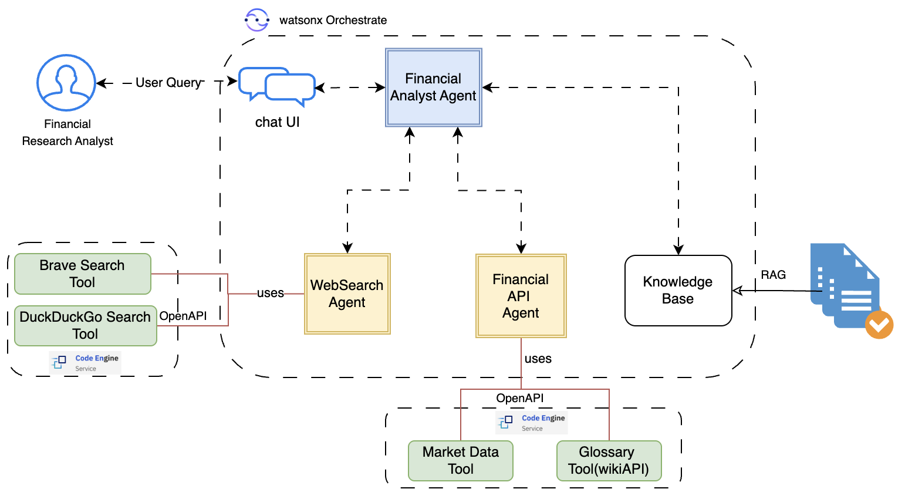

# 🥇 Agente Analista Financeiro

## 🤔 O Problema

A Blue Aurum Financial está buscando expandir e escalar seus investimentos para entregar mais valor aos acionistas. No entanto, sua equipe de analistas de pesquisa financeira está tendo dificuldades para identificar novas oportunidades de investimento com agilidade, devido ao longo tempo necessário para pesquisa e diligência sobre potenciais investimentos.

O processo que seguem é majoritariamente manual, exigindo que o analista revise relatórios financeiros de uma entidade de interesse e os compare com outras entidades do mesmo setor ou nas quais a Blue Aurum Financial já investiu. Após gerar um resumo comparativo, o analista realiza buscas online para obter detalhes sobre a empresa, sua equipe de gestão, relatórios de analistas recentes e notícias atuais. Também utilizam ferramentas internas de modelagem financeira para projetar retornos potenciais.

Para resumir, alguns dos desafios enfrentados pelos analistas da Blue Aurum Financial incluem:

- A pesquisa manual leva a atrasos na identificação de novas oportunidades de investimento.
- A pesquisa envolve o uso de ferramentas internas para modelagem, busca externa por dados públicos e análise de relatórios financeiros, exigindo esforço manual significativo.
- A volatilidade do mercado e a mudança no sentimento de investidores/analistas exigem que os analistas revisem continuamente suas análises e recomendações.

## 🎯 Objetivo

A Blue Aurum Financial pretende implementar um Agente de Pesquisa Financeira com IA para apoiar sua equipe de analistas, acelerando a pesquisa e gerando oportunidades de investimento de alto valor. O objetivo é criar uma solução agente com IA que auxilie os analistas nas seguintes tarefas:

* Analisar relatórios financeiros e extrair informações-chave.
* Fornecer análise comparativa entre diferentes entidades com base nos relatórios financeiros.
* Buscar informações públicas sobre uma entidade, incluindo notícias e relatórios de analistas recentes.
* Executar ferramentas internas para recuperar métricas financeiras via APIs.
* Gerar um relatório com os achados e análises.

Ao automatizar essas tarefas, a empresa busca acelerar o processo de pesquisa para identificar novas oportunidades de investimento.

## 📈 Valor para o Negócio

* Redução no tempo de pesquisa manual.
* Atualizações automatizadas e em tempo real sobre o mercado, incluindo notícias, dados e relatórios de analistas.
* Recomendações aprimoradas com base em diligência e pesquisa automatizada.

## 🏛 Arquitetura

Para agilizar o processo de pesquisa, a Blue Aurum Financial fez parceria com a IBM para desenvolver uma solução de Pesquisa Financeira Multiagente baseada no [watsonx Orchestrate](https://www.ibm.com/products/watsonx-orchestrate). A arquitetura abaixo ilustra os diversos agentes de IA envolvidos, bem como as ferramentas utilizadas para execução de tarefas.

A arquitetura é composta por agentes especializados de IA que colaboram para desempenhar funções-chave:

* **Agente de Busca Web**: especializado em realizar buscas na internet e recuperar informações atualizadas. Utiliza várias ferramentas de busca, como DuckDuckGo e Brave, e agrega os resultados para entregar uma resposta completa e coerente.

* **Agente de API Financeira**: especializado em recuperar informações utilizando a ferramenta de Glossário (para explicar termos financeiros) e uma ferramenta de Dados de Mercado. Neste bootcamp, usamos essa ferramenta para demonstrar como o agente pode recuperar dados de mercado. Na prática, outras ferramentas podem ser adicionadas, representando, por exemplo, ferramentas internas de modelagem via API.

* **Agente Analista Financeiro**: é o agente orquestrador principal que responde às consultas dos analistas financeiros. É um agente inteligente capaz de raciocinar com base na entrada do usuário e decidir a melhor forma de responder. Pode utilizar uma base de conhecimento interna seguindo o padrão RAG (Geração Aumentada por Recuperação) ou delegar a outro agente para atender melhor à consulta.

Este sistema aproveita o poder do [watsonx Orchestrate](https://www.ibm.com/products/watsonx-orchestrate), a plataforma da IBM de no-code/low-code/pro-code para soluções com agentes de IA, e do [watsonx.ai](https://www.ibm.com/products/watsonx-ai), a plataforma da IBM para hospedagem de modelos de base como LLMs (Modelos de Linguagem de Grande Escala).

Para resumir, você aprenderá neste bootcamp como utilizar as capacidades do watsonx Orchestrate para desenvolver múltiplos agentes e ferramentas associadas, criando um agente de pesquisa financeira que ajuda a acelerar a análise de investimentos. O agente tem habilidades em interpretar documentos (como relatórios de lucros), realizar análises comparativas, buscar notícias recentes na web e recuperar dados de mercado — tudo para ajudar os analistas a encontrar informações relevantes rapidamente e fazer recomendações de investimento.

## 📝 Laboratório Prático Passo a Passo

Você pode encontrar as instruções detalhadas aqui:

[Guia prático passo a passo](hands-on-lab-banking.md)

## 🎥 Vídeo de Demonstração

Demonstração em vídeo da solução:

https://github.ibm.com/skol/agentic-ai-client-bootcamp/assets/3814/b8dcddde-9187-4a12-ba8f-9271573a0c30
