# 👨🏻‍💻 Caso de uso: Agente Analista Financeiro

## Índice
- [Descrição do caso de uso](#Descrição-do-caso-de-uso)
- [Arquitetura](#Arquitetura)
- [Pre-requisitos](#pre-requisitos)
- [watsonx Orchestrate](#watsonx-orchestrate)
  - [Acessando o watsonx Orchestrate](#Acessando-o-watsonx-Orchestrate)
- [Criação de Agente Analista Financeiro](#Criação-de-Agente-Analista-Financeiro)
  - [Configuração do agente com base de conhecimento](#Configuração-do-agente-com-base-de-conhecimento)
- [Criação e configuração do agente de API financeira](#Criação-e-configuração-do-agente-de-API-financeira)
- [Criação e configuração do agente de pesquisa na Web](#Criação-e-configuração-do-agente-de-pesquisa-na-Web)
- [Juntando tudo - Colaboração completa do agente](#Juntando-tudo---Colaboração-completa-do-agente)
- [Experimente os agentes em ação usando a interface de bate-papo do Watsonx Orchestrate](#Experimente-os-agentes-em-ação-usando-a-interface-de-bate---papo-do-Watsonx-Orchestrate)
- [Conclusão](#Conclusão)

## Descrição do caso de uso

A Blue Aurum Financial planeja implementar um Agente de Pesquisa Financeira com tecnologia de IA para auxiliar sua equipe de analistas de pesquisa financeira a acelerar suas pesquisas e gerar oportunidades de investimento de alto valor. O objetivo é criar soluções de agente com tecnologia de IA que apoiem analistas de pesquisa financeira na execução das seguintes tarefas:

* Analisar relatórios financeiros e extrair informações importantes.
* Fornecer análises comparativas entre diferentes entidades com base em seus relatórios financeiros.
* Pesquisar informações públicas para obter detalhes sobre uma entidade, bem como notícias recentes e relatórios de analistas.
* Executar ferramentas internas para recuperar métricas financeiras via APIs.
* Gerar um relatório com as descobertas e análises.

Ao automatizar essas tarefas, a empresa visa acelerar o processo de pesquisa para identificar novas oportunidades de investimento.

## 🏛 Arquitetura  <a id="architecture"></a>


## Pre-requisitos
Para executar as etapas desta parte do laboratório prático do bootcamp, você precisa ter acesso ao **watsonx Orchestrate** e ao **watsonx.ai**, que são fornecidos a você como parte da preparação para este bootcamp.


## watsonx Orchestrate
Conforme detalhado no [Solution Architecture](images/banking-fra-architecture.png), construiremos e implementaremos a maioria dos agentes da solução no Watsonx Orchestrate. Agentes de IA são entidades autônomas que podem executar tarefas, decidir e interagir com seu ambiente. No IBM Watsonx Orchestrate, os agentes são um componente essencial que permite a criação de sistemas complexos e dinâmicos que podem se adaptar e responder a mudanças nas condições.

### Acessando o watsonx Orchestrate
Para acessar o Watsonx Orchestrate, siga estas etapas:

1- Se você ainda não estiver conectado à sua conta IBM Cloud, navegue até https://cloud.ibm.com no seu navegador preferido e faça login com suas credenciais (que você usou para sua reserva no TechZone).

2- Na página inicial do IBM Cloud, clique no menu de navegação superior esquerdo (menu de hambúrguer) e selecione **Resource list** (anotado com retângulo vermelho).
*Observação: se você for membro de várias contas do IBM Cloud, certifique-se de estar trabalhando na conta correta (marcada com um oval vermelho) que tenha os serviços necessários disponíveis, conforme explicado no environment-setup.
 

3- Na página Lista de Recursos, expanda a seção **AI / Machine Learning** (anotado com seta vermelha), e clique em **Watsonx Orchestrate** (anotado com retângulo vermelho).
 

4- Clique em **Launch watsonx Orchestrate** (anotado com seta vermelha) para iniciar o serviço.
 

5- Após o lançamento do serviço Watsonx Orchestrate, você será direcionado para a página inicial, conforme ilustrado na figura abaixo. Você verá uma interface de conversação intuitiva com um campo de bate-papo (marcado com um retângulo vermelho) onde poderá digitar qualquer texto para começar a interagir com o Watsonx Orchestrate. Ao iniciar uma nova instância do serviço, não haverá agentes personalizados definidos e, portanto, a seção em **Agents** irá mostrar *No agents available*. Você pode clicar **Create or Deploy** um agente na seção Agentes ou você pode clicar **Create new agent** (indicado pela seta vermelha) para começar a desenvolver novos agentes. Você também pode selecionar o link **Gerenciar agentes** para navegar até a página de gerenciamento de agentes.
Tente digitar algumas perguntas genéricas e observe as respostas do modelo de linguagem grande (LLM) que alimenta o agente pré-construído no Watsonx Orchestrate, o que garante a funcionalidade básica até que os agentes personalizados sejam criados.
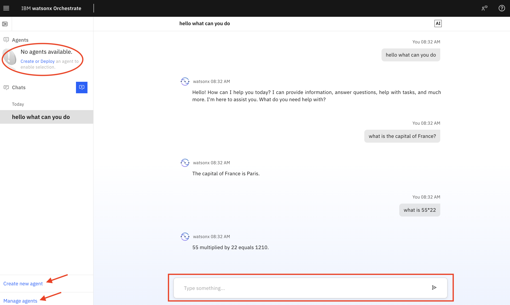 

## Criação de Agente Analista Financeiro
Nesta seção, você percorrerá o processo de criação de um agente de IA no watsonx Orchestrate:

6- Para começar a construir agentes, você pode clicar em **Create new agent** conforme referenciado na etapa 5 ou, alternativamente, clique no menu de navegação superior esquerdo, expanda o **Build**  (anotado com seta vermelha) e selecione **Agent Builder** (indicado com um retângulo vermelho). Isso o redirecionará para a página Gerenciar agentes.
 

7- A página Gerenciar agentes estará inicialmente em branco, pois nenhum agente foi criado ainda. À medida que você cria mais e mais agentes de IA capazes de raciocinar e agir, a página Gerenciar agentes será preenchida com esses agentes. Clique no botão **Create agent**  (anotado com seta vermelha) para começar a construir seu primeiro agente.
 

8- Na página Criar um agente, selecione **Create from scratch**  (anotado com retângulo vermelho), forneça um **Name** e uma **Description** para o agente e clique **Create** (anotado com seta vermelha).

Name: 
```
Agente Analista Financeiro

```

Description: 
```
Agente especializado em pesquisa financeira utilizando conhecimento interno e busca externa de informações públicas.
```
A descrição em linguagem natural de um agente é importante, pois é utilizada pela solução agêntica para encaminhar as mensagens do usuário ao agente certo e qualificado para atender à solicitação. Para mais detalhes, consulte o [Compreendendo o atributo de descrição do Agente de IA](https://www.ibm.com/docs/en/watsonx/watson-orchestrate/current?topic=agents-creating#understanding-the-description-attribute-for-ai-agent) documentation.

O Watsonx Orchestrate permite a criação de um agente do zero ou a partir de um modelo, o que envolve navegar por um catálogo de agentes existentes e usar atributos de outro agente como modelo para o novo agente. Neste laboratório, você criará agentes do zero.

*Observação: é recomendável revisar o blog [O que são agentes de IA?](https://www.ibm.com/think/topics/ai-agents) para obter algumas informações básicas sobre como os agentes de IA funcionam.*
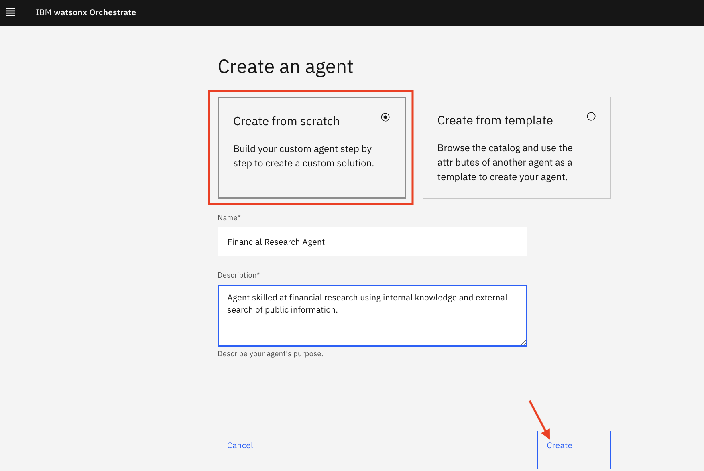 

### Configuração do agente com base de conhecimento
Após a criação do Agente de IA, nesta seção, você passará pelo processo de configuração do agente com conhecimento e ferramentas para permitir que ele responda a consultas usando informações da base de conhecimento e execute tarefas usando as ferramentas.

9- Em seguida, você passará pelo processo de configuração do seu agente. A página do Agente de Pesquisa Financeira é dividida em duas metades. A metade direita é uma interface de bate-papo de **Visualização** (indicada com um oval vermelho) que permite testar o comportamento do seu agente. A metade esquerda da página consiste em quatro seções principais (indicadas com retângulos vermelhos) que você pode usar para configurar seu agente.

   - Profile: A seção **Profile** contém a descrição do agente que você forneceu ao criá-lo. Você pode acessar esta seção para editar e refinar a descrição do agente conforme necessário.

   - Knowledge: A seção **Knowledge** é onde você pode adicionar conhecimento ao agente. Adicionar conhecimento aos agentes desempenha um papel crucial no aprimoramento de suas capacidades de conversação, fornecendo-lhes as informações necessárias para gerar respostas precisas e contextualmente relevantes para casos de uso específicos. Você pode enviar arquivos diretamente para o agente ou conectar-se a uma instância do Milvus ou Elasticsearch como um repositório de conteúdo. Por meio dessa interface de **Knowledge**, você pode habilitar seus agentes de IA para implementar o padrão de Geração Aumentada de Recuperação (RAG), um padrão de IA muito popular para fundamentar respostas em uma fonte confiável de dados, como uma base de conhecimento empresarial.
   
   *Observação: para obter mais detalhes, consulte a documentação [Adicionando conhecimento aos agentes](https://www.ibm.com/docs/en/watsonx/watson-orchestrate/current?topic=agents-adding-knowledge).*

   - Toolset: Enquanto **Knowledge** é como você capacita agentes com uma base de conhecimento confiável, **Toolset** é como você capacita agentes a agir, fornecendo a eles *Tools* e *Agents*. Os agentes podem realizar tarefas usando **Tools** ou delegar tarefas a outros **Agents** que sejam profundamente qualificados nessas tarefas.

   *Observação: Para obter mais detalhes, consulte as seções [Adicionando ferramentas a um agente](https://www.ibm.com/docs/en/watsonx/watson-orchestrate/current?topic=agents-adding-tools) e [Adicionando agentes para orquestração](https://www.ibm.com/docs/en/watsonx/watson-orchestrate/current?topic=agents-adding-orchestration) da documentação.*
   
   - Behavior: A seção **CompoBehaviorrtamento** da configuração do agente é onde você fornece instruções ao agente para definir como ele responde às solicitações e situações do usuário. Você pode configurar regras que determinam quando e como o agente deve agir. Essas regras ajudam o agente a se comportar de maneira previsível e consistente, proporcionando uma experiência perfeita ao usuário.

   *Observação: Para obter mais detalhes, consulte a documentação [Adicionando instruções aos agentes](https://www.ibm.com/docs/en/watsonx/watson-orchestrate/current?topic=agents-adding-instructions).

Por fim, após concluir a configuração do seu agente e testar seu desempenho, você pode **Implantar** o agente (indicado pela seta vermelha) para disponibilizá-lo no canal selecionado. No momento, o principal canal suportado é a página inicial do *Chat* que você acessa ao iniciar o watsonx Orchestrate pela primeira vez. O produto adicionará suporte a canais adicionais onde você poderá implantar seu(s) agente(s).

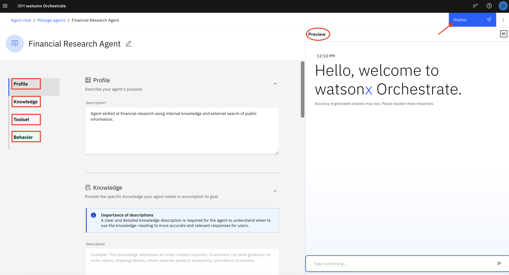 

10- Na página de configuração do agente, revise a *Descrição* do agente na seção **Profile** e mantenha-a como está (sem necessidade de edição). Em seguida, role para baixo até a seção **Knowledge** ou clique no atalho **Knowledge** (indicado com um oval vermelho). Na seção Conhecimento, adicione uma descrição para informar o agente sobre o conteúdo do conhecimento. Para este laboratório, adicione a seguinte descrição, pois forneceremos ao agente diversos relatórios de lucros recentes de algumas empresas.

Description: 
```
Este conhecimento aborda todos os detalhes sobre os relatórios de lucros das empresas de interesse. Analistas de pesquisa podem perguntar sobre quaisquer detalhes dos relatórios de lucros.
```

Em seguida, você precisa escolher como fornecer informações de conhecimento ao agente. O watsonx Orchestrate oferece suporte à adição de conhecimento ao agente, seja enviando arquivos diretamente pela interface do usuário ou apontando para um repositório de conteúdo (Mivlus ou ElasticSearch). A documentação [Adicionando conhecimento aos agentes](https://www.ibm.com/docs/en/watsonx/watson-orchestrate/current?topic=agents-adding-knowledge) fornece mais detalhes. Para este laboratório, clique em **Upload files**  (anotado com seta vermelha) para enviar arquivos PDF capturando relatórios de lucros da AMZN, META, NVDA e NFLX.

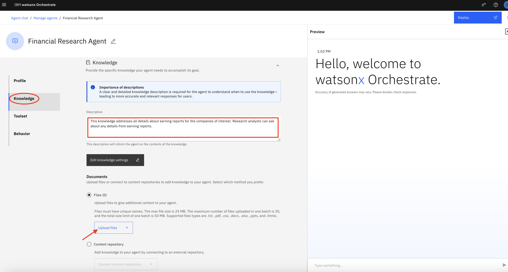 


Arraste e solte os seguintes arquivos PDF para enviar ao conhecimento do agente:
   - [AMZN-Q4-2024-Earnings.pdf](../../anexos/financial/AMZN-Q4-2024-Earnings_ptBR.pdf)
   - [META-Q4-2024-Earnings.pdf](../../anexos/financial/META-Q4-2024-Earnings_ptBR.pdf)
   - [NFLX-Q4-2024-Earnings.pdf](../../anexos/financial/NFLX-Q4-2024-Earnings_ptBR.pdf)
   - [NVDA-Q4-2024-Earnings.pdf](../../anexos/financial/NVDA-Q4-2024-Earnings_ptBR.pdf)

 


11- Após o upload de todos os arquivos para a base de conhecimento, você pode começar a testar o agente para validar como ele responde a perguntas usando essa base de conhecimento. Os arquivos enviados são processados ​​e preparados para serem utilizados pelo agente. Após a conclusão do upload, teste o agente fazendo algumas perguntas, como:

```Você pode me falar sobre os negócios da Meta?```

```Tenho interesse em saber mais sobre a Meta e a Amazon. Você pode me contar um pouco sobre os negócios deles?```

Você deverá ver as respostas sendo recuperadas dos documentos enviados e, em seguida, a resposta final gerada pelo agente, conforme ilustrado na figura abaixo.

 

Neste momento, vale a pena refletir um pouco sobre o que você desenvolveu até agora. Você projetou um agente e o capacitou com uma base de conhecimento para que ele possa responder a consultas em contexto usando sua base de conhecimento. *Parabéns!!*

Ao revisar a arquitetura, você concluiu a parte da solução agêntica que envolveu a criação do agente Analista Financeiro e sua capacitação com uma base de conhecimento (indicada com retângulos vermelhos na figura abaixo). Na próxima seção, você trabalhará no processo de criação do **Agente de API financeira** e o **Agente de pesquisa na Web**, que você adicionará como agentes colaboradores ao **Agente de analista financeiro**.

 

## Criação e configuração do agente de API financeira
Nesta seção, você desenvolverá o Agente de API Financeira, um dos agentes colaboradores especificamente habilitado para retornar dados de mercado e definições de glossários. Neste laboratório prático, o Agente de API Financeira conta com duas ferramentas: a **Ferramenta de Dados de Mercado**, que retorna preços de ações, e a **Ferramenta de Glossário**, que utiliza a Wikipédia para retornar definições de glossários. Na prática, este agente também pode acessar outras ferramentas internas, como as de modelagem do comportamento de ações ou previsão de preços de ações; a abordagem para capacitar o agente com essas ferramentas seria a mesma.

12- Se você não estiver na página inicial do watsonx Orchestrate (interface de bate-papo), repita as etapas acima para garantir que você esteja conectado ao IBM Cloud, localize o serviço watsonx Orchestrate e inicie-o para acessar a página inicial.

13- From the watsonx Orchestrate landing page, click **Create agent** (anotado com retângulo vermelho) para começar a desenvolver um novo agente, o Agente de API Financeira.

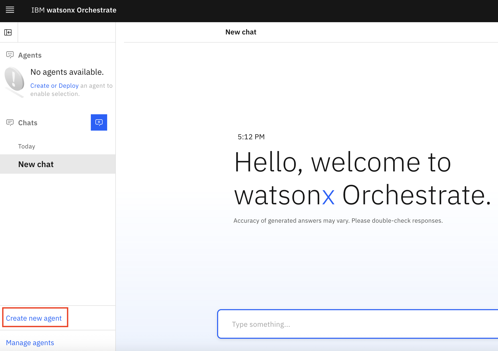 

14- Na página Criar um agente, selecione **Create from scratch**, provide a **Name** e uma **Description** para o agente e clique **Create** (annotated with red arrow).

Name: ```Agente API Financeiro```

Descrição: 
```
Agente especializado em recuperar dados de mercado, bem como definições de glossário para termos financeiros.
```
Conforme explicado anteriormente, a descrição de um agente é importante, pois ela é aproveitada pela solução de agente para encaminhar mensagens do usuário ao agente certo e qualificado para atender à solicitação.

 

15- Na página de configuração do agente, role para baixo até **Toolset** ou clique no atalho (anotado com oval vermelho). Em seguida, clique no botão **Add tool**  (anotado com seta vermelha) para abrir a janela para adicionar ferramentas ao agente.

 

16- No pop-up de opções da ferramenta, selecione **Import** (anotado com retângulo vermelho) conforme ilustrado na figura abaixo.

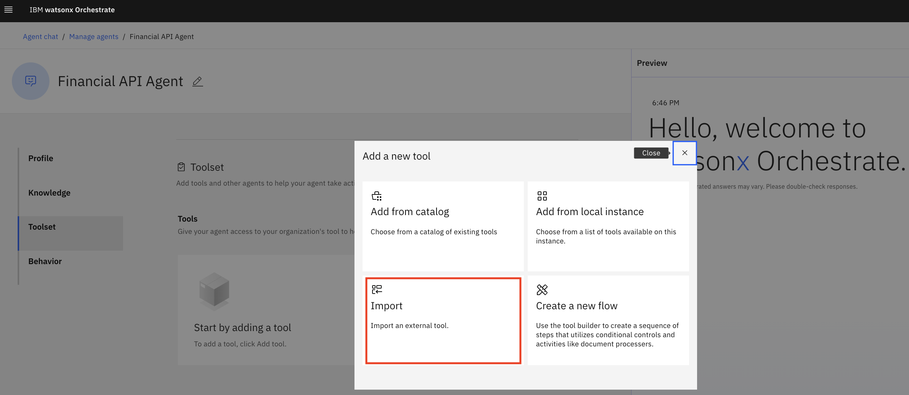 

O watsonx Orchestrate oferece suporte a várias abordagens para adicionar ferramentas a agentes, conforme explicado na documentação [Adicionando ferramentas a um agente](https://www.ibm.com/docs/en/watsonx/watson-orchestrate/current?topic=agents-adding-tools):

   - Adicionar do catálogo: A opção **Add from catalog** permite adicionar uma ferramenta de um catálogo completo de ferramentas predefinidas. O catálogo de ferramentas está sendo desenvolvido ativamente para facilitar ainda mais a adição de ferramentas aos agentes.

   - Adicionar da instância local: A opção **Add from local instance** permite adicionar uma ferramenta de um conjunto existente de ferramentas já carregadas na instância local do Watsonx Orchestrate.

   - Importar: A opção **Import** permite importar uma ferramenta externa usando uma especificação OpenAPI e selecionando quais operações você deseja importar como ferramentas.

   - Criar um novo fluxo: A opção **Create a new flow** fornece uma interface de construtor de ferramentas com recurso de arrastar e soltar para criar uma sequência de etapas que utiliza controles e atividades condicionais.

Além disso, você pode usar o [Agentic Development Kit (ADK)](https://developer.watson-orchestrate.ibm.com/) do watsonx Orchestrate para desenvolver e carregar ferramentas Python e OpenAPI em uma instância específica do watsonx Orchestrate, que você pode então adicionar aos agentes.
O watsonx Orchestrate também suporta a adição de ferramentas do [Model Context Protocol (MCP)](https://developer.watson-orchestrate.ibm.com/). Se você não estiver familiarizado com ele, o MCP é um padrão para conectar agentes de IA a sistemas onde os dados residem, incluindo repositórios de conteúdo, ferramentas de negócios e ambientes de desenvolvimento. O MCP está se tornando cada vez mais popular como o padrão para habilitar agentes com ferramentas.

Para fins do Agente de API Financeira, você usará a opção **Import** para importar uma especificação OpenAPI e definir quais operações importar como ferramentas. Você precisará do arquivo [financial_api_openapi.json](../../anexos/financial/financial_api_openapi.json).

17- Na página da ferramenta Importar, arraste e solte o arquivo e clique em **Next** (annotated with red arrow).

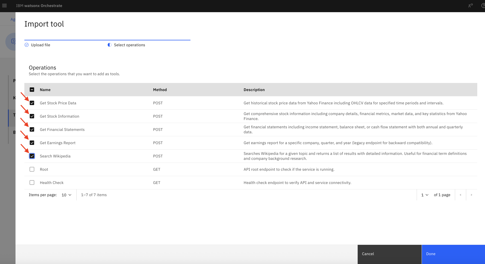 

18- Em seguida, marque as caixas de seleção para as operações **Obter dados de preços de ações**, **Obter informações sobre ações**, **Obter demonstrações financeiras**, **Obter relatório de lucros** e **Pesquisar na Wikipédia** (anotadas com setas vermelhas) e clique em **Done**.

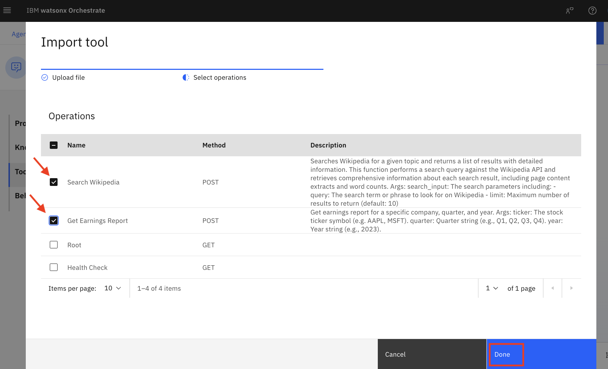 

19- Neste ponto, você verá as ferramentas importadas na subseção Ferramentas, o que significa que elas estão disponíveis para o **Agente da API Financeira** usar essas ferramentas na execução de tarefas que exigem a recuperação de dados de mercado ou a obtenção de informações de glossário.

20- Em seguida, role mais para baixo até o **Behavior** ou clique no atalho do **Behavior**  (anotado com oval vermelho) e adicione as seguintes instruções para orientar o agente em seu raciocínio e orquestração.

Instruções:
```
Você é um Agente Analista Financeiro que fornece pesquisas e análises financeiras abrangentes. Suas habilidades incluem:

**Análise de Ações:**
- Obtenha dados de preços de ações em tempo real e desempenho histórico usando o Yahoo Finanças
- Obtenha informações abrangentes da empresa, incluindo métricas financeiras, dados de mercado e descrições de negócios
- Acesse demonstrações financeiras detalhadas (demonstração de resultados, balanço patrimonial, demonstração de fluxo de caixa) com dados anuais e trimestrais

**Pesquisa e Informações:**
- Pesquise na web por notícias financeiras atuais, relatórios de analistas e insights de mercado usando o Brave Search
- Encontre definições de termos financeiros e informações básicas da empresa usando a busca na Wikipédia
- Forneça análises contextuais combinando múltiplas fontes de dados

**GUIA DE SELEÇÃO DE FERRAMENTAS:**

**Ferramenta OBTER INFORMAÇÕES SOBRE AÇÕES** - Use para:
- Métricas atuais da empresa (índice P/L, capitalização de mercado, margem de lucro, beta)
- Fundamentos da empresa (setor, indústria, descrição do negócio)
- Índices de avaliação e estatísticas financeiras
- Preço atual da ação com métricas-chave
- Comparações e análises de empresas

**Ferramenta OBTER DADOS DE PREÇOS DE AÇÕES** - Use para:
- Desempenho histórico de preços e tendências
- Análise de séries temporais (1 dia a 10 anos)
- Análise de volume de negociação e volatilidade
- Análise técnica e padrões de preços
- Desempenho em períodos específicos

**Ferramenta OBTER DEMONSTRAÇÕES FINANCEIRAS** - Use para:
- Dados financeiros trimestrais/anuais (resultados do 1º, 2º, 3º e 4º trimestres)
- Demonstrações de resultados, balanços patrimoniais, demonstrações de fluxo de caixa
- Tendências e comparações financeiras históricas
- Análise de dívida, crescimento da receita, métricas de lucratividade
- Desempenho financeiro plurianual

**Ferramenta PESQUISAR NA WIKIPEDIA** - Use para:
- Definições e explicações de termos financeiros
- Conteúdo educacional sobre conceitos financeiros
- Histórico e histórico da empresa

**Diretrizes de resposta:**
- Para métricas e índices atuais, use a ferramenta OBTER INFORMAÇÕES SOBRE AÇÕES
- Para análise de desempenho histórico, use a ferramenta OBTER DADOS DE PREÇOS DE AÇÕES
- Para demonstrações financeiras trimestrais/anuais, use a ferramenta OBTER DEMONSTRAÇÕES FINANCEIRAS
- Para definições e informações educacionais, use a ferramenta PESQUISAR NA WIKIPEDIA
- Sempre forneça insights baseados em dados com métricas específicas, quando disponíveis
- Cite suas fontes e indique quando os dados são em tempo real ou históricos

**Exemplos de Casos de Uso Aprimorados:**
- "Qual é o índice P/L atual da Apple?" → Use a ferramenta OBTER INFORMAÇÕES SOBRE AÇÕES
- "Qual foi o desempenho da Apple nos últimos 6 meses?" → Use a ferramenta OBTER DADOS SOBRE PREÇOS DE AÇÕES
- "Mostre-me os resultados da Apple no 1º trimestre de 2024" → Use a ferramenta OBTER DEMONSTRAÇÕES FINANCEIRAS (com ano: 2024, trimestre: "1º trimestre")
- "Compare os valores de mercado da Apple e da Tesla" → Use a ferramenta OBTER INFORMAÇÕES SOBRE AÇÕES para ambas as empresas
- "Tendência de crescimento da receita da Apple nos últimos 3 anos" → Use a ferramenta OBTER DEMONSTRAÇÕES FINANCEIRAS (com anos_retroativos: 3)
- "O que é margem EBITDA?" → Use a ferramenta PESQUISA NA WIKIPÉDIA
- "Índice dívida/patrimônio líquido da Tesla nos últimos 3 anos" → Use a ferramenta OBTER DEMONSTRAÇÕES FINANCEIRAS (statement_type: "balance", years_back: 3)

**Exemplos de ferramentas múltiplas:**
- "Analisar o desempenho e a avaliação da Apple" → OBTER INFORMAÇÕES SOBRE AÇÕES + OBTER DADOS SOBRE O PREÇO DAS AÇÕES
- "Comparar os resultados do primeiro trimestre da Apple e do Google com os índices P/L" → OBTER DEMONSTRAÇÕES FINANCEIRAS + OBTER INFORMAÇÕES SOBRE AÇÕES para ambas
- "Explicar o EBITDA e mostrar a tendência do EBITDA da Microsoft" → PESQUISAR NA WIKIPÉDIA + OBTER DEMONSTRAÇÕES FINANCEIRAS
```

Além disso, desative a barra deslizante (indicada pela seta vermelha) para desativar o acesso do **Agente da API Financeira** na interface de chat. Este agente é apenas um agente de suporte ao **Agente Analista Financeiro** e, portanto, deve ser desativado para não aparecer na interface de chat.

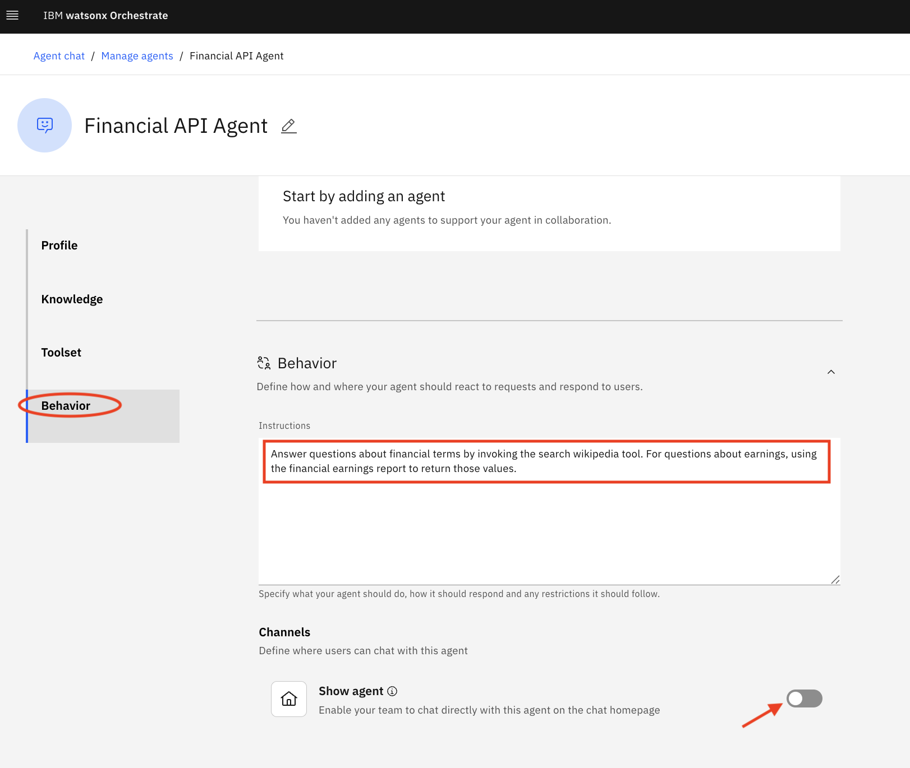

21- Agora que você concluiu a criação do agente e adicionou as ferramentas necessárias, teste as ferramentas na seção Visualização fazendo uma pergunta de exemplo, como:

```
qual foi a receita e o lucro da Amazon em 2023?
```

Observe a resposta baseada nas informações retornadas pela ferramenta Dados de Mercado. Para verificar isso, clique no link **Mostrar Raciocínio** (indicado com uma seta vermelha) para expandir o raciocínio do agente. Observe que o agente está chamando corretamente a ferramenta **Obter_Declarações_Financiadoras** (indicada com um oval vermelho) e que ela mostra tanto a entrada quanto a saída da chamada da ferramenta.

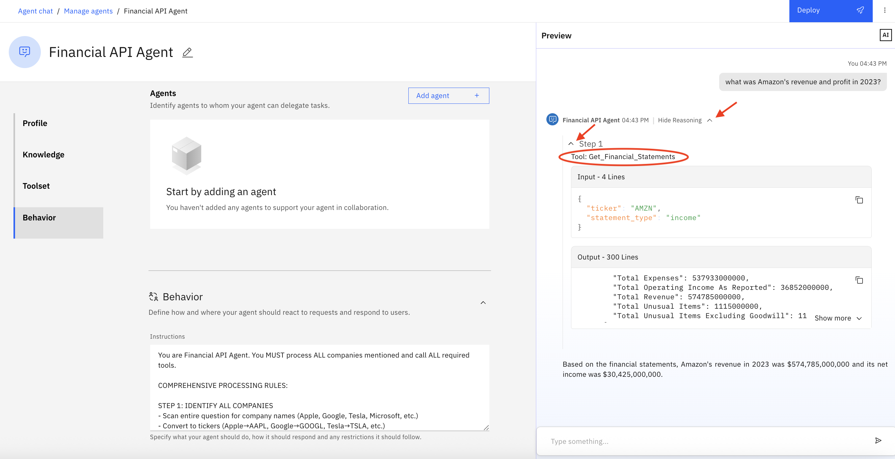 

22- Teste o **Agente de API Financeira** mais detalhadamente fazendo outra pergunta:
```O que significa EBITDA?```

Novamente, observe a resposta e expanda o link **Mostrar raciocínio** para rastrear o raciocínio do agente que, neste caso, acionou corretamente a ferramenta **Pesquisar na Wikipedia** (anotada com um oval vermelho).

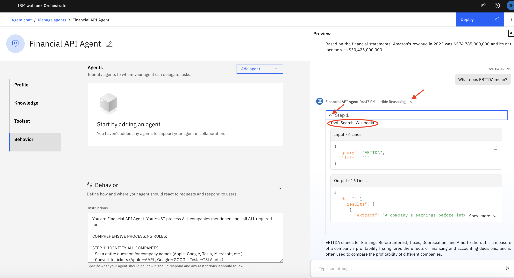 

23- Neste ponto, clique no botão **Deploy** para implantar o agente e torná-lo disponível para ser usado como um agente colaborador.

 

*Parabéns!!* Você acabou de concluir o desenvolvimento do **Agente de API Financeira** equipado com ferramentas para retornar dados de ganhos e definições de glossário.

## Criação e configuração do agente de pesquisa na Web
Nesta seção, você desenvolverá o **Agente de Busca na Web**, outro agente colaborador especializado em buscar na web e retornar detalhes publicamente disponíveis sobre uma entidade, bem como notícias e relatórios de analistas recentes.

A arquitetura faz referência a diversas ferramentas de busca na web, a saber, a **Brave Search Tool** e a **DuckDuckGo Search Tool**. Como essas ferramentas de busca na web utilizam tecnologias subjacentes diferentes, o uso de ambas pode retornar informações mais relevantes, e o Agente de Busca na Web se encarregará de agregar a resposta final. Neste laboratório prático, você adicionará a **DuckDuckGo Search Tool** e concluirá o laboratório prático usando apenas essa ferramenta de busca.

*Opcional* Você pode verificar com seu instrutor se ele também configurou a **Brave Search Tool** e, em seguida, você pode tentar adicioná-la. Se você adicionar a **Brave Search Tool**, precisará atualizar as instruções para o agente recuperar resultados de busca de diversas ferramentas e agregá-los.

24- ISe você não estiver na página inicial do watsonx Orchestrate (interface de bate-papo), repita as etapas anteriores para garantir que você esteja conectado ao IBM Cloud, localize o serviço watsonx Orchestrate e inicie-o para acessar a página inicial.

25- Na página inicial do watsonx Orchestrate, que é a interface do usuário do bate-papo, clique em **Create new agent** (anotado com seta vermelha) para começar a criar o Agente de Pesquisa na Web.

 

26- Repita os passos anteriores para criar um agente do zero e forneça o seguinte nome e descrição para o agente de pesquisa na web. Clique em **Create** (indicado pela seta vermelha).

Name: 
```
Agente de pesquisa na web
```

Descrição: 
```
Este agente pode pesquisar na web para recuperar informações relacionadas à consulta do usuário.
```

 

27- Na página de configuração do agente, role para baixo até a seção **Toolset** ou clique no atalho **Toolset** shortcut (anotado com oval vermelho) e clique em **Add tool** (anotado com seta vermelha).

 

28- Conforme explicado anteriormente, o Watsonx Orchestrate oferece suporte a diversas abordagens para adicionar ferramentas aos agentes. Para o Agente de Pesquisa na Web, você aproveitará a funcionalidade de **Import** como você fez antes. Clique no **Import** (anotado com retângulo vermelho).

 

29- Na página da ferramenta Importar, arraste e solte o arquivo [websearch_openapi.json](../../anexos/financial/websearch_openapi.json) e clique  **Next**

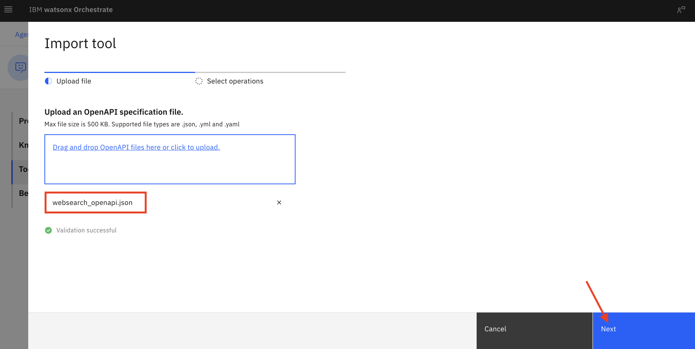 

30- Em seguida, marque as caixas de seleção para a operação **Get DuckDuckGo Search Results**  (anotado com seta vermelha)e clique **Done**.

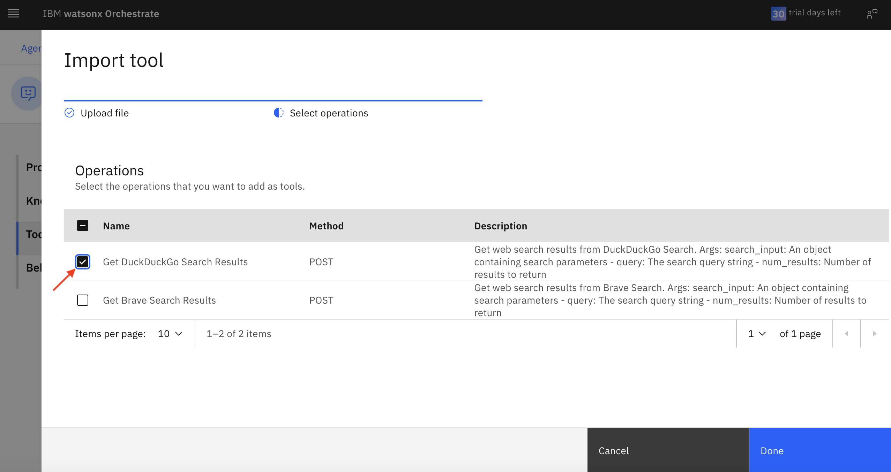 

31- ANeste ponto, você verá a ferramenta importada na subseção Ferramentas, o que significa que ela está disponível para o **Agente de Pesquisa na Web** usar essas ferramentas na execução de tarefas que exigem pesquisas na web e recuperação de dados relacionados à consulta do usuário.

32- Role mais para baixo até a seção **Behavior** da página de configuração do agente e adicione as seguintes **Instruções** para ajudar a orientar o comportamento do agente.

Instruções: 
```
Para informações sobre notícias recentes ou mais recentes, use a ferramenta de busca Brave. Além disso, para consultas gerais, onde as informações estão disponíveis online e podem ser recuperadas por meio de uma busca na web, use a ferramenta de busca DuckDuckGo.
```

Em seguida, teste a funcionalidade do agente fazendo uma pergunta como ```Você pode mostrar os principais executivos da Amazon?``` e observe a resposta do agente. Clique no link **Show Reasoning** (indicado pela seta vermelha) e observe como o agente está invocando corretamente a **DuckDuckGo Search Tool**  para recuperar informações relevantes.

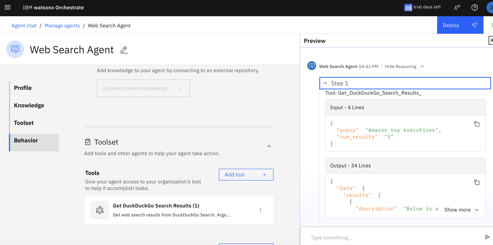 

33- Agora que você configurou e testou o **Agente de Pesquisa na Web**, pode implantá-lo para torná-lo acessível como um agente colaborador. Para isso, desative a barra deslizante (indicada pela seta vermelha) para desativar o acesso do **Agente de Pesquisa na Web** na interface de chat. Este agente é apenas um agente de suporte ao **Agente de Analista Financeiro** e, portanto, deve ser desativado para não aparecer na interface de chat.

Agora clique em **Deploy** para implantar o agente e torná-lo disponível para ser usado como um agente colaborador.

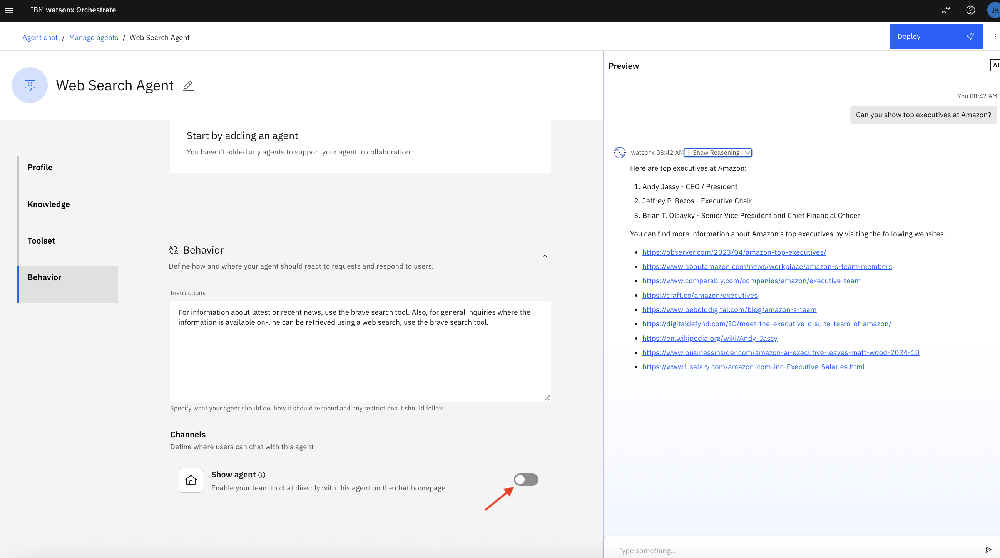 

*Parabéns!!* Você acabou de concluir o desenvolvimento do **Agente de Busca na Web**, equipado com ferramentas para pesquisar na web e recuperar informações relevantes.

*Observação: Na seção opcional ao final do laboratório, você aprenderá como adicionar outra ferramenta baseada em uma ferramenta de busca na web MCP hospedada externamente*

## Juntando tudo - Colaboração completa do agente <a id="pulling-it-together"></a>
Agora que você desenvolveu todos os agentes e ferramentas, nesta seção, você trabalhará no processo de integração dos agentes colaboradores, testando e implantando o **Agente de Analista Financeiro**.

34- Se você não estiver na página inicial do watsonx Orchestrate (interface de bate-papo), repita as etapas anteriores para garantir que você esteja conectado ao IBM Cloud, localize o serviço watsonx Orchestrate e inicie-o para acessar a página inicial.

35- On the watsonx Orchestrate landing page, which is the Chat UI, click **Manage agents** (anotado com seta vermelha).

 

36- Na página manage agents, selecione o **Agente Analista Financeiro** (anotado com retângulo vermelho).

 

37- Na página de configuração do **Agente de analista financeiro**, role para baixo até a seção **Toolset** ou clique no atalho **Toolset** (anotado com um oval vermelho) e, em seguida, clique em **Add agent** (anotado com uma seta vermelha) para adicionar um agente colaborador.

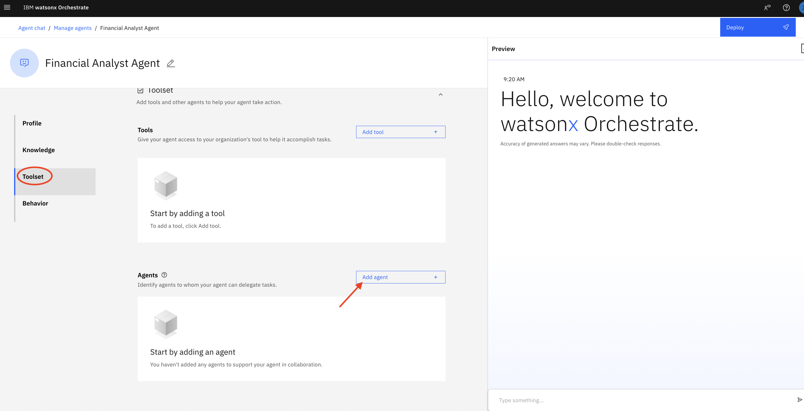 

38- No pop-up, selecione **Add from local instance** tile. Para referência, o watsonx Orchestrate oferece suporte a diversas abordagens para adicionar agentes de colaboração. Reserve um minuto para consultar a documentação [Adicionando agentes para orquestração](https://www.ibm.com/docs/en/watsonx/watson-orchestrate/current?topic=agents-adding-orchestration) para obter uma visão geral das diferentes abordagens, incluindo a opção de adicionar um agente de colaboração a partir de um catálogo completo de agentes pré-criados ou de outros agentes definidos na instância local, ou até mesmo importar um agente externo.

 

39- Marque a caixa de seleção ao lado de **Agente de Pesquisa na Web** e **Agente de API Financeira** (anotado com setas vermelhas) e clique no botão **Adicionar ao agente** (anotado com oval vermelho).

 

40- Role mais para baixo até o **Behavior** ou clique no atalho do **Behavior**  (anotado com oval vermelho) e adicione as seguintes **Instruções** para orientar o agente em seu raciocínio e orquestração.

Instruções:
```
Você é um Analista Financeiro que fornece pesquisas e análises financeiras abrangentes. Suas habilidades incluem:

**Análise de Ações:**
- Obtenha dados de preços de ações em tempo real e desempenho histórico usando o Yahoo Finanças
- Obtenha informações abrangentes da empresa, incluindo métricas financeiras, dados de mercado e descrições de negócios
- Acesse demonstrações financeiras detalhadas (demonstração de resultados, balanço patrimonial, demonstração de fluxo de caixa) com dados anuais e trimestrais

**Pesquisa e Informações:**
- Pesquise na web por notícias financeiras atuais, relatórios de analistas e insights de mercado usando o Brave Search
- Encontre definições de termos financeiros e informações básicas da empresa usando a busca na Wikipédia
- Forneça análises contextuais combinando múltiplas fontes de dados

**GUIA DE SELEÇÃO DE FERRAMENTAS:**

**Ferramenta OBTER INFORMAÇÕES SOBRE AÇÕES** - Use para:
- Métricas atuais da empresa (índice P/L, capitalização de mercado, margem de lucro, beta)
- Fundamentos da empresa (setor, indústria, descrição do negócio)
- Índices de avaliação e estatísticas financeiras
- Preço atual da ação com as principais métricas
- Comparações e análises de empresas

**Ferramenta OBTER DADOS DE PREÇOS DE AÇÕES** - Use para:
- Desempenho histórico de preços e tendências
- Análise de séries temporais (1 dia a 10 anos)
- Análise de volume de negociação e volatilidade
- Análise técnica e padrões de preços
- Desempenho em períodos específicos

**Ferramenta OBTER DEMONSTRAÇÕES FINANCEIRAS** - Use para:
- Dados financeiros trimestrais/anuais (resultados do 1º, 2º, 3º e 4º trimestres)
- Demonstrações de resultados, balanços patrimoniais, demonstrações de fluxo de caixa
- Tendências e comparações financeiras históricas
- Análise de dívida, crescimento da receita, métricas de lucratividade
- Desempenho financeiro plurianual

**Ferramenta PESQUISAR NA WIKIPEDIA** - Use para:
- Definições e explicações de termos financeiros
- Conteúdo educacional sobre conceitos financeiros
- Histórico e informações históricas da empresa

**Diretrizes de Resposta:**
- Para métricas e índices atuais, use a ferramenta OBTER INFORMAÇÕES SOBRE AÇÕES
- Para análise de desempenho histórico, use a ferramenta OBTER DADOS DE PREÇOS DE AÇÕES
- Para demonstrações financeiras trimestrais/anuais, use a ferramenta OBTER DEMONSTRAÇÕES FINANCEIRAS
- Para definições e informações, use a ferramenta PESQUISAR NA WIKIPEDIA
- Sempre forneça insights baseados em dados com métricas específicas, quando disponíveis
- Cite suas fontes e indique quando os dados são em tempo real ou históricos

**Casos de Uso de Exemplo Aprimorados:**
- "Qual é o índice P/L atual da Apple?" → Use a ferramenta OBTER INFORMAÇÕES SOBRE AÇÕES
- "Qual foi o desempenho da Apple nos últimos 6 meses?" → Use a ferramenta OBTER DADOS DE PREÇOS DE AÇÕES
- "Mostre-me os resultados do 1º trimestre de 2024 da Apple" → Use a ferramenta OBTER DEMONSTRAÇÕES FINANCEIRAS (com ano: 2024, trimestre: "1º trimestre")
- "Compare os valores de mercado da Apple e da Tesla" → Use a ferramenta OBTER INFORMAÇÕES DE AÇÕES para ambas as empresas
- "Tendência de crescimento da receita da Apple nos últimos 3 anos" → Use a ferramenta OBTER DEMONSTRAÇÕES FINANCEIRAS (com anos_retroativos: 3)
- "O que é margem EBITDA?" → Use a ferramenta PESQUISA NA WIKIPÉDIA
- "Índice dívida/patrimônio líquido da Tesla nos últimos 3 anos" → Use a ferramenta OBTER DEMONSTRAÇÕES FINANCEIRAS (statement_type: "balance", years_back: 3)

**Exemplos de ferramentas múltiplas:**
- "Analisar o desempenho e a avaliação da Apple" → OBTER INFORMAÇÕES SOBRE AÇÕES + OBTER DADOS SOBRE O PREÇO DAS AÇÕES
- "Comparar os resultados do primeiro trimestre da Apple e do Google com os índices P/L" → OBTER DEMONSTRAÇÕES FINANCEIRAS + OBTER INFORMAÇÕES SOBRE AÇÕES para ambas
- "Explicar o EBITDA e mostrar a tendência do EBITDA da Microsoft" → PESQUISAR NA WIKIPÉDIA + OBTER DEMONSTRAÇÕES FINANCEIRAS
```

Teste o comportamento do agente na seção **Visualização** fazendo a seguinte pergunta de exemplo:
Pergunta:
```
Tenho interesse em saber mais sobre a Meta e a Amazon. Com base em nosso conhecimento interno, você poderia gerar um resumo sobre os negócios deles?
```

Expanda os links **Show Reasoning** e **Step 1** para revisar o raciocínio do agente. Observe que ele está recuperando corretamente as informações de sua base de conhecimento, pois faz referência à ferramenta **Financial_Analyst_Agent**.

 

41- Continue testando seu agente agora, enfatizando a funcionalidade do agente de busca na web. Para isso, faça a seguinte pergunta:

Pergunta:
```
Quem são os principais executivos da Amazon?
```

Expanda os links **Show Reasoning** e **Step 1** (indicado com setas vermelhas) para observar o raciocínio do agente. Observe que ele transfere a solicitação para o **Agente de Pesquisa na Web** conforme o esperado (indicado com um oval vermelho).
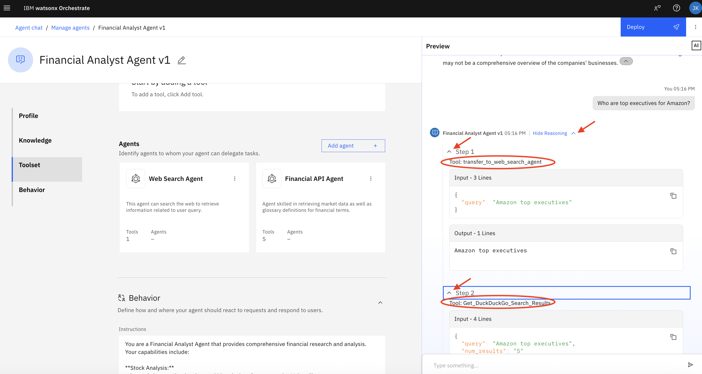 

42- Faça mais testes perguntando ao agente a seguinte pergunta e, em seguida, expandindo **Mostrar Raciocínio** e **Etapa 1** (indicados com setas vermelhas) para observar o raciocínio do agente.
Pergunta:
```
O que significa EBITDA?
```

Observe que ele transfere a solicitação para o **Agente de API Financeira**, conforme indicado pelo oval vermelho.
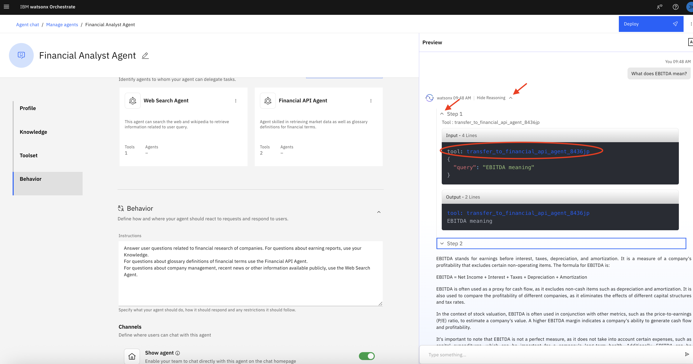 

Depois disso, expanda **Step 2** (anotado com seta vermelha) para observar o segundo passo dado pelo agente, que neste caso, envolve a execução da ferramenta real, a ferramenta **Pesquisar na Wikipédia** (anotada com oval vermelho).

 

43- Neste ponto, você está pronto para implementar seu **Agente de Analista Financeiro**. Para isso, role até o final da página de configuração e certifique-se de que a barra deslizante ao lado de **Mostrar agente** (indicada com uma seta vermelha) esteja habilitada (verde) para tornar o **Agente de Analista Financeiro** acessível na interface de chat. Clique no botão **Implementar** (indicado com uma seta vermelha) para implementar seu agente.

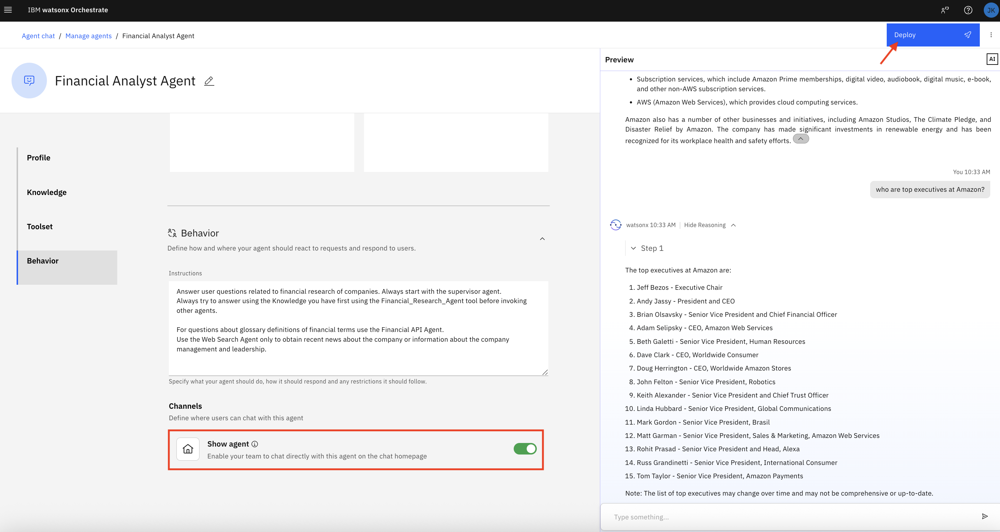

*Parabéns!!* Você acabou de desenvolver e implantar o **Agente de Analista Financeiro** para dar suporte aos analistas de pesquisa financeira da **Blue Aurum Financial** na ampliação de suas pesquisas e recomendações de investimentos.

## Experimente os agentes em ação usando a interface de bate-papo do Watsonx Orchestrate

Agora que você implantou seu **Agente de Analista Financeiro**, você pode interagir com o agente usando a Interface Conversacional do Watsonx Orchestrate.

44- Clique no menu de navegação superior esquerdo e selecione **Chat** (anotado com retângulo vermelho) para acessar a interface de conversação.

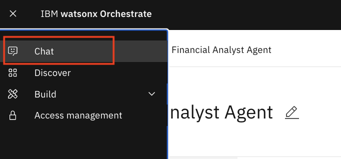

45- Na interface do **Chat**, observe que agora você tem o **Agente Analista Financeiro** (indicado com um retângulo vermelho) como um dos agentes disponíveis para conversar. À medida que você adiciona mais agentes, pode selecionar com qual agente deseja interagir selecionando a lista suspensa de agentes (indicada com uma seta vermelha).
Com o **Agente Analista Financeiro** selecionado, tente interagir fazendo a seguinte pergunta e observe a resposta.

Pergunta:
```
Tenho interesse em saber mais sobre a Meta e a Amazon. Com base em nosso conhecimento interno, você poderia gerar um resumo sobre os negócios deles?
```


46- Expanda o **Show Reasoning** e **Step 1**  (indicado com setas vermelhas) para investigar o raciocínio do agente ao recuperar a resposta. Nesse caso, o agente utiliza sua base de conhecimento para responder.

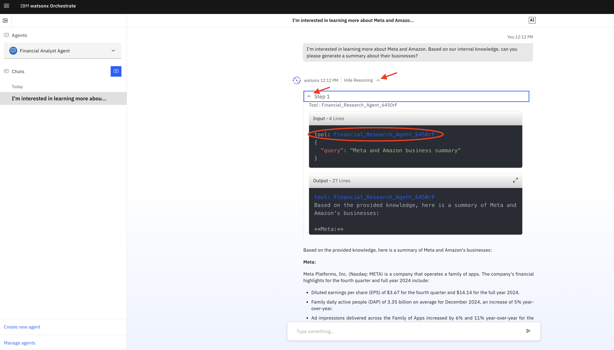

47- Em seguida, faça a seguinte pergunta para obter uma lista dos principais executivos da Amazon.
Pergunta:
```
Quem são os principais executivos da Amazon?
```
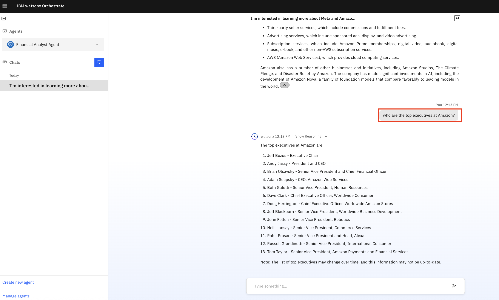

Novamente, expanda o **Show Reasoning** e **Step 1** (indicado com setas vermelhas) para investigar o raciocínio do agente ao recuperar a resposta. Nesse caso, o agente utiliza o **Agente de Pesquisa na Web** para recuperar a resposta.


48- Em seguida, tente outra pergunta para obter uma definição do glossário para o lucro diluído por ação, que foi retornada na primeira resposta.
Pergunta:
```
Você pode definir o termo financeiro do glossário "Lucro diluído por ação"?
```

Expanda o **Show Reasoning** e observe que o agente deu 3 passos (anotados com retângulo vermelho) para recuperar a resposta para esta pergunta.


49- Agora, vamos tentar explorar quais são as etapas executadas.
Expanda as seções **Step1**, **Step2** e **Step3** e observe o agente transferindo a solicitação ao **Agente da API Financeira** para fornecer uma definição para o termo financeiro 'Lucro por ação diluído'.

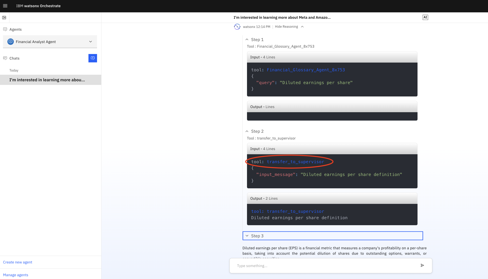


Sinta-se à vontade para explorar e experimentar o poder dos Agentes em ação! 🚀 

## Conclusão
**Parabéns** por concluir a parte prática do bootcamp.

Recapitulando, você utilizou a funcionalidade sem código do watsonx Orchestrate para desenvolver um **Agente de Analista Financeiro** especializado em ajudar analistas de pesquisa financeira a acelerar suas pesquisas e due diligence na identificação de novas oportunidades de investimento. Em seguida, você adicionou conhecimento ao agente, enviando documentos de conhecimento em formato PDF com relatórios de ganhos.

Em seguida, você aprimorou os recursos do **Agente de Analista Financeiro** desenvolvendo dois outros agentes, o **Agente de Pesquisa na Web** e o **Agente de API Financeira**, que possuem ferramentas para executar consultas de pesquisa na web e também recuperar informações de APIs internas e ferramentas de definição de glossário.
Essas ferramentas e agentes ajudam a aumentar o poder do **Agente de Analista Financeiro** no fornecimento de resultados de pesquisa em tempo hábil aos analistas.