# 👨🏻‍💻 Caso de uso: Automação de negócios

## Índice
- [Arquitetura](#-arquitetura)
- [Descrição do caso de uso](#Descrição-do-caso-de-uso)
- [Pré-requisitos](#pre-requisites)
- [Laboratório de Agentes - watsonx.ai](#agent-lab---watsonxai)
  - [Agente de comparação](#Agente-de-Comparação)
    - [Setup](#setup)
    - [Configuração](#Configuração)
    - [Tools](#tools)
    - [Salvando e implantando](#Salvando-e-Implantando)
- [Integrando o agente do watsonx.ai como um agente externo no watsonx Orchestrate](#Integrando-o-agente-do-watsonx.ai-como-um-Agente-Externo-no-watsonx-Orchestrate)
- [Agente orquestrate](#orchestrate-agent)
  - [Agente de Produto](#Agente-de-Produto)
- [Experimente agentes em ação](#Experimente-agentes-em-ação)


[](../../anexos/businessautomation/AgenticAI-BusinessAutomation-LabGuide.pdf)


## 🏛 Arquitetura  


## Descrição do caso de uso

O departamento de vendas da ABC Motor Corp, uma grande empresa automotiva, ao preparar propostas de vendas, dedicava muito tempo para entender as características dos produtos concorrentes e compará-los com os seus próprios produtos. A ABC Motor Corp precisa de um sistema automatizado de análise competitiva para ajudar suas equipes de vendas a identificar e posicionar seus produtos rapidamente em relação aos concorrentes. Tradicionalmente, a coleta de insights sobre a concorrência exigia extensa pesquisa manual, o que a tornava ineficiente e propensa a informações desatualizadas. Portanto, o objetivo deste caso de uso é criar um sistema habilitado para IA que suporte a análise competitiva e a pesquisa de mercado do cliente.

## Pre-requisites

- Verifique com seu instrutor se **todos os sistemas** estão funcionando antes de continuar.
- Consulte o guia [environment-setup](/environment-setup) para obter as etapas de criação da chave de API, configuração do projeto e configurações relacionadas.
- Se você for um instrutor que ministra este laboratório, consulte os **Guias do instrutor** para configurar todos os ambientes e sistemas.

## Agent Lab - watsonx.ai

>**Observação:** Antes de iniciar a criação do agente, certifique-se de ter gerado sua chave de API da instância watsonx.ai.

Criaremos um agente **Agente de Comparação** no Laboratório de Agentes do watsonx.ai como parte desta configuração:

Na página inicial do Laboratório de Agentes, clique em Criar um agente de IA para automatizar tarefas.

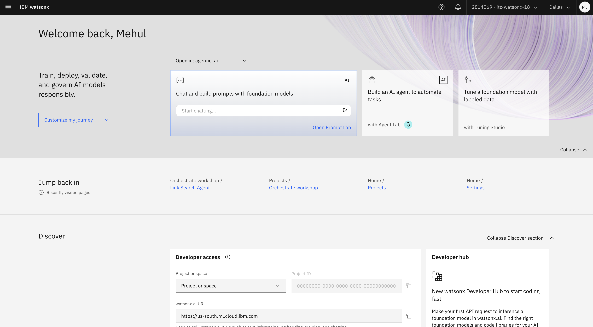 

Vamos iniciar o **Agente de Comparação**.

### Agente de Comparação
#### Setup  
1. Digite o nome do agente:  Agente de comparação 
2. Adicione a Descrição
```
O agente compara os dados fornecidos com informações adicionais coletadas dos resultados de pesquisa do Google.
```
  

#### Configuração
1. Escolha **LangGraph** como framework.
2. Selecione **ReAct** como arquitetura.
3. Insira as **Instruções** conforme mostrado na imagem. Essas instruções orientam seu agente sobre quais tarefas ele deve executar. Você pode usar o prompt abaixo para isso.
```
Você é um especialista na indústria automobilística, combinando os detalhes fornecidos na sua janela de contexto. Sua tarefa é rastrear e pesquisar as 3 principais URLs de produtos (exclusivamente da indústria automobilística) e analisar e comparar produtos com base nos seguintes recursos: Alcance, Preço, Aceleração, Velocidade Máxima, Interior e Recursos de Segurança. Se um recurso não for aplicável, marque-o como N/A. Além disso, realize uma análise SWOT dos principais produtos (Forças, Fraquezas, Oportunidades e Ameaças). Apresente a comparação em 3 tabelas: uma para a comparação, a segunda para a classificação numérica (X/5) e uma classificação por estrelas (★ de ★★★★★) para cada recurso e a terceira para a análise SWOT. Dê um título a cada tabela. Após cada tabela, forneça dois divisores.
Instruções:
1. Quando solicitado a informar os concorrentes do produto em questão, certifique-se de fornecer apenas o nome dos produtos e os URLs dos produtos abaixo do nome correspondente.
2. As URLs dos produtos gerados devem ser estritamente da indústria automobilística.
3. Título da Tabela 1: Comparação de Recursos
4. Título da Tabela 2: Comparação de Avaliações
5. Certifique-se de que a tabela de Comparação de Avaliações contenha a classificação numérica (X/5) e a classificação por estrelas (★ de ★★★★★).
6. Os produtos devem ser os nomes das colunas em todas as tabelas.
7. A fonte do Título da Tabela deve estar em negrito e o tamanho da fonte deve ser 40% maior em comparação com o restante do texto.
8. Adicione o espaço apropriado entre cada seção da tabela.
9. Nomeie as Referências como Concorrentes.
```
  


> **Observação:** A ferramenta de busca do Google é adicionada por padrão ao Agente. No entanto, se você clicar acidentalmente no ícone de exclusão, siga as etapas da ferramenta abaixo. Caso contrário, você pode pular esta etapa.

#### Tools  

1. Clique em Add Tool.


2. Selecione **Pesquisa Google** como ferramenta para coletar dados.
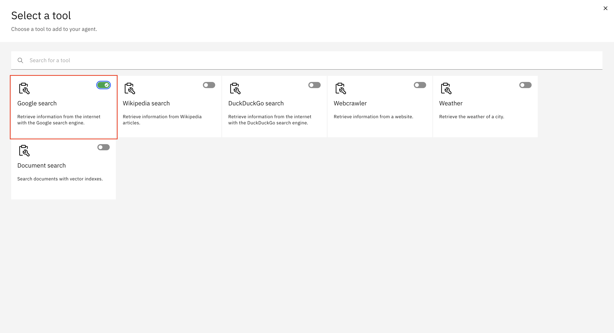  

#### Salvando e Implantando
Após a criação do agente.

1. Clique no botão **Salvar como** para salvar seu agente
2. Clique no botão **Implantar** para implantar o agente.
 
3. Após clicar no botão salvar como, selecione Agente (marcado como 1) e clique em Salvar ((marcado como 2))
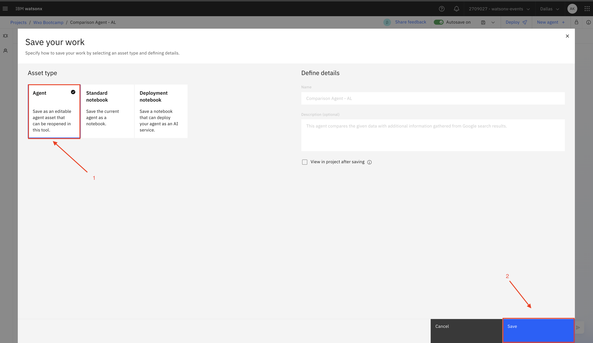
4. Após clicar em "Implementar", você precisa criar uma chave de API de usuário. Clique em "Create".

5. Você será direcionado para outra página da web. Clique em "Create a key".

6. Após criar a chave, volte para a página de implantação. Clique em "Reload".

7. Após clicar no botão de implantação, certifique-se de que seu espaço de implantação direcionado foi selecionado e concluído; caso contrário, selecione-o (marcado como 1). Clique em Implantar para implantar o agente (marcado como 2).


> **VOCÊ CONSEGUIU! Você acabou de criar e implantar seu primeiro Agente de IA.**
> Agora vamos construir mais agentes e integrá-los.

## Integrando o agente do watsonx.ai como um Agente Externo no watsonx Orchestrate

To deploy your agent on Orchestrate, follow the steps below: 

1. Acesse a página inicial do watsonx.ai Agent Lab.


2. Clique no menu do hambúrguer e selecione **Deployments**.  
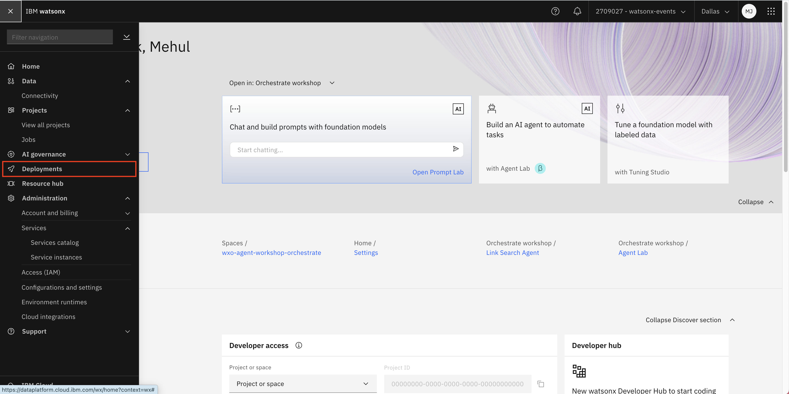

3. Clique na aba **Spaces** e selecione o espaço onde você implantou o agente.
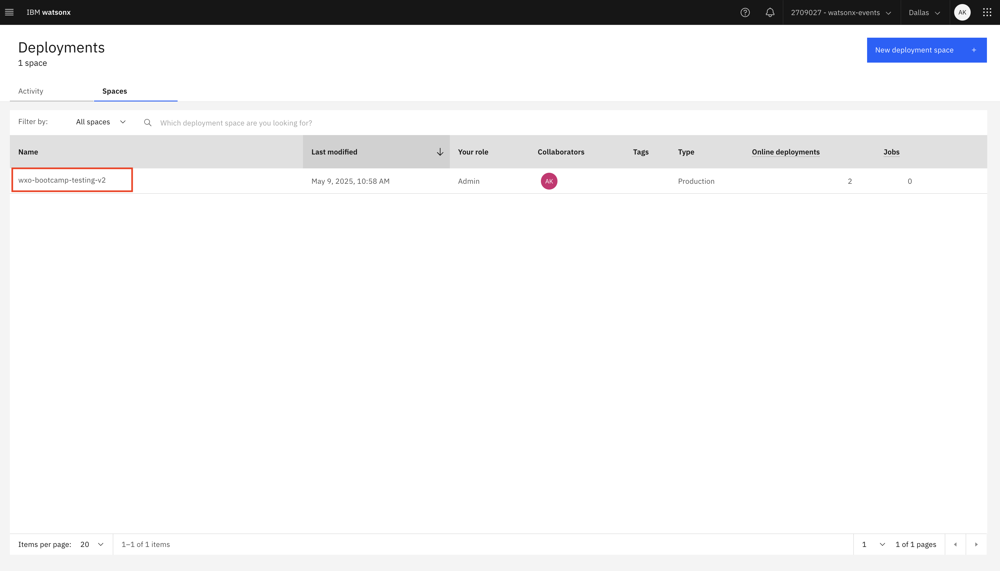

4. Clique na aba **Assets** e selecione o agente.  


5. Em seguida, você irá para a página principal de implantação e selecionará seu agente na lista.


6. Em seguida, copie o fluxo de ponto de extremidade público um.


Então vamos ao Orchestrate e criar outro agente e importar este agente para ele.

## Orchestrate Agent

No Orchestrate, criaremos nosso agente principal, conforme descrito abaixo:

### Agente de Produto

1. Acesse a página inicial do Orchestrate, clique no menu de hambúrguer (☰), selecione Build, e depois Agent Builder.


2. Cicar no botão Create Agent .


3. Selecione Criar do zero (como mostrado na imagem 1 abaixo), insira o nome do seu agente (como mostrado na imagem 2), forneça uma descrição (como mostrado na imagem 3) e clique no botão Criar (como mostrado na imagem 4).

Nome: Agente de Produtos

Descrição:
   ```
Este agente foi projetado para pesquisar um produto específico e recuperar seus detalhes e características usando a Geração Aumentada de Recuperação (RAG) no catálogo de produtos. Ele apresenta as informações em um formato claro e estruturado, garantindo a organização sistemática dos principais dados do produto, facilitando a compreensão e o uso.
   ```
   

4. Após a criação do agente, navegue até a página Configuração do agente.

Descrição:
   ```
  Sua base de conhecimento é o documento que contém todas as informações relacionadas ao produto. Todas as dúvidas relacionadas ao produto serão abordadas usando este documento como fonte primária.
   ```
   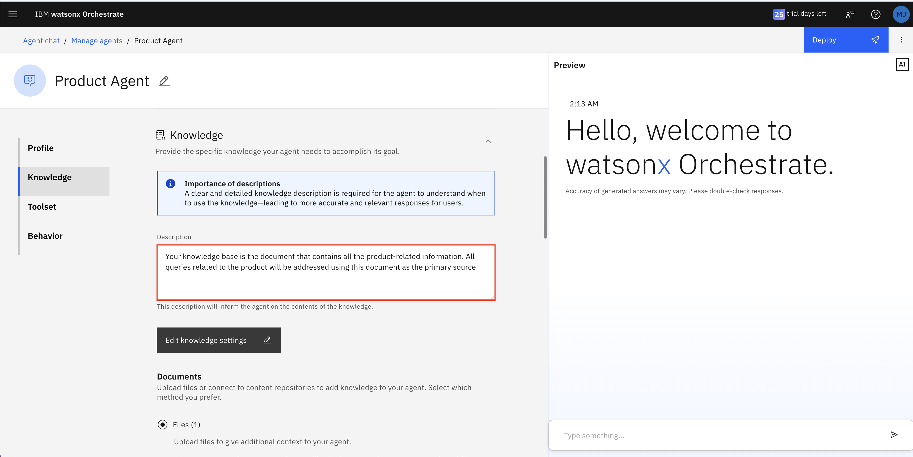

5. Role para baixo até a seção Conhecimento e, na seção Documento, clique no botão Carregar arquivo e carregue [o catálogo de produtos](../../anexos/businessautomation/ABC_Motor_Product_Catalog_ptbr.pdf).
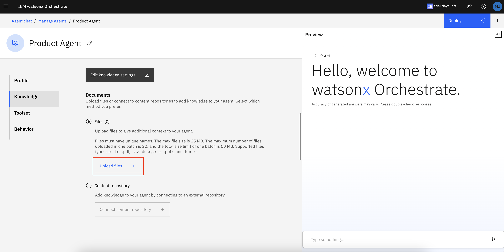

6. Role para baixo até a seção Conjunto de ferramentas e, na seção Agentes, clique no botão Adicionar agente.
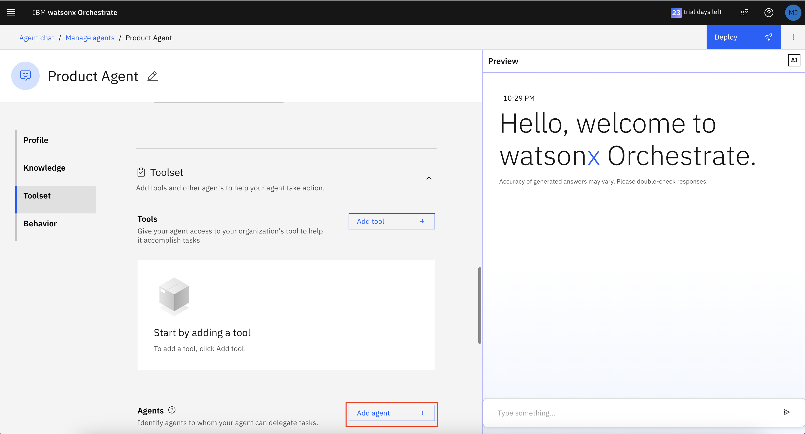

7. No menu pop-up, selecione Importar.
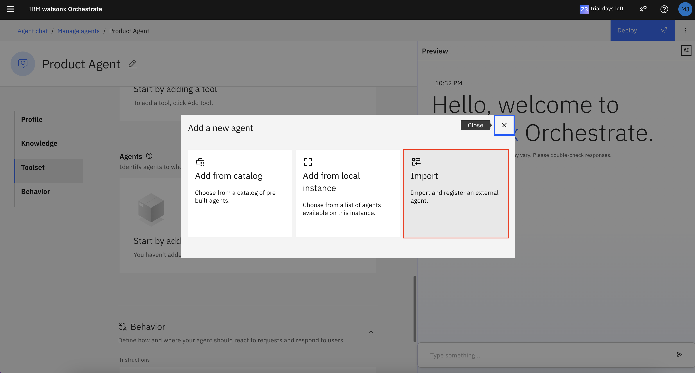

> **Observação:** agora estamos adicionando o Agente de Comparação (um agente externo) ao Agente de Produto, permitindo que ele delegue tarefas a eles.

8. Na próxima página, certifique-se de que a opção Agente Externo esteja selecionada (como mostrado na imagem 1 abaixo). Se ainda não estiver selecionada, selecione-a e clique no botão Avançar (como mostrado na imagem 2).


9. Na próxima página, insira as seguintes informações:
      1. Fornecer: No menu selecione watsonx.ai.
      2. API key: Enter the watsonx.ai API key.
      3. Service instance URL: Insira a URL do ponto de extremidade público do agente que copiamos na etapa 6.
      4. Display name: Agente_de_comparacao_v1
      5. Description: Enter the below description.
      6. Clique no botão Agente de importação.

**Description:**
   ```
   Este agente foi projetado para pesquisar URLs concorrentes do produto de entrada e comparar os dados fornecidos com informações adicionais coletadas nos resultados de pesquisa do Google. Sua tarefa é analisar cuidadosamente os dados de entrada, extrair insights importantes e identificar diferenças e semelhanças. Os resultados devem ser apresentados em um formato de tabela bem estruturado, facilitando a compreensão e a comparação das informações rapidamente.
   ```
   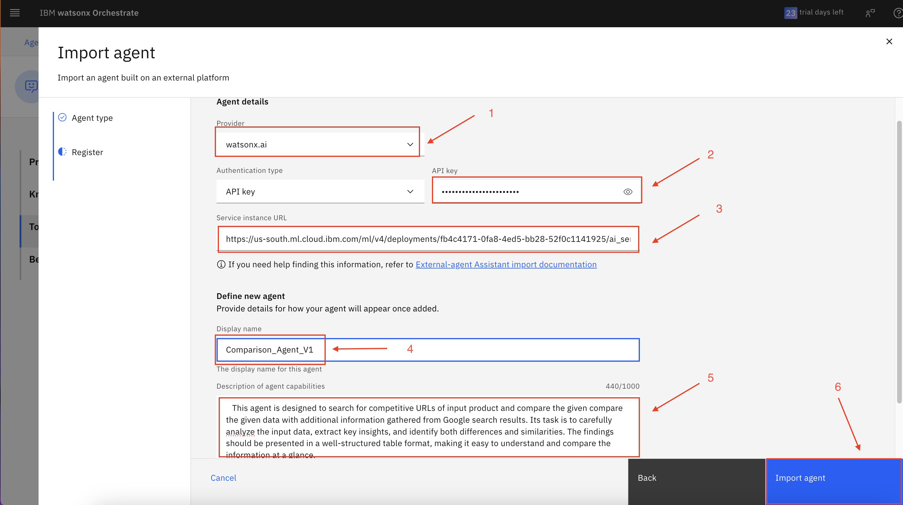

10. Depois que os agentes delegados forem adicionados, eles aparecerão conforme mostrado na imagem abaixo.


11. Role para baixo até a seção Behavior, adicione a descrição mostrada na imagem como 1 e clique no botão Implantar, conforme mostrado na imagem como 2.

      Para o Agente do Produto, use a descrição abaixo na Seção Behavior.

      ```
      Este agente é responsável por lidar com consultas relacionadas a produtos usando a Geração Aumentada de Recuperação (RAG) no catálogo de produtos.
      Para consultas gerais sobre produtos, ele recupera informações estruturadas diretamente da base de conhecimento.
      Para consultas que envolvem URLs, referências da web ou comparação, ele delega a tarefa ao Agente de Comparação.

      ```
      

> **Observação:** o Agente de Produto agora está pronto para lidar com consultas relacionadas ao produto, delegando tarefas ao Agente de Pesquisa de Links e ao Agente de Comparação, conforme necessário.

## Experimente agentes em ação
Siga os passos acima e tente interagir com o caso de uso usando estas consultas de exemplo:

1. Agente de Produto

Faça as seguintes perguntas para obter respostas do Agente de Produto:
```
P1: Quais são os produtos da ABC Motors?
```
```
P2: Dê-me as informações do Zenith X3.
```
   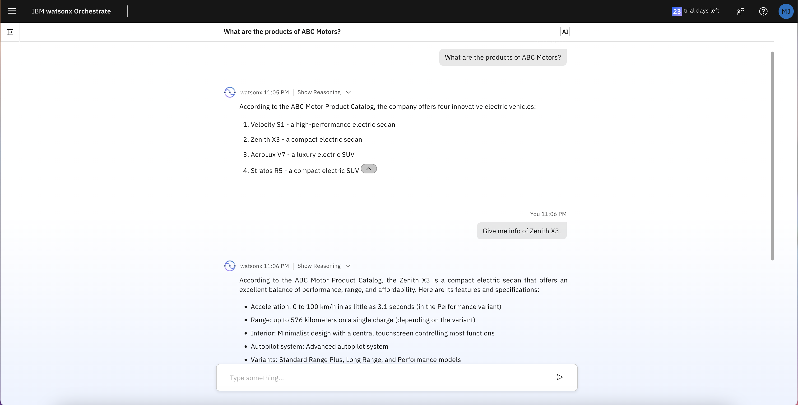  

3. Agente de comparação

Para comparar os dados recuperados, pergunte:
```
Forneça-me as URLs dos concorrentes do produto acima e mostre-me também a comparação.
```
   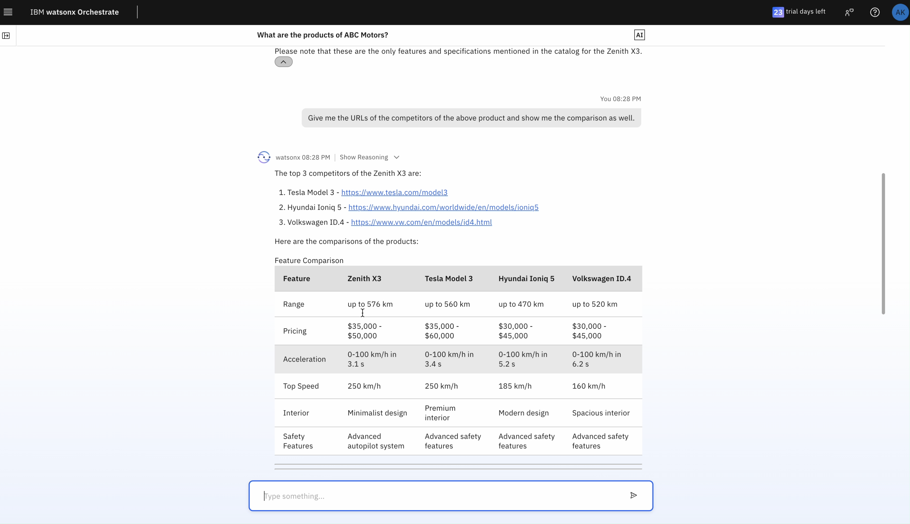  
   

Agora, explore e experimente o poder das Habilidades e Agentes em ação!🚀 
