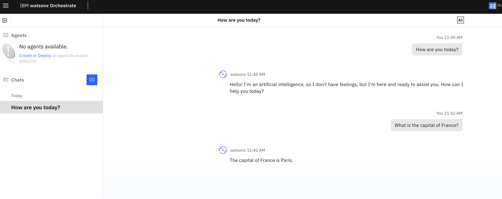
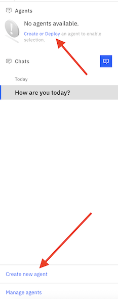
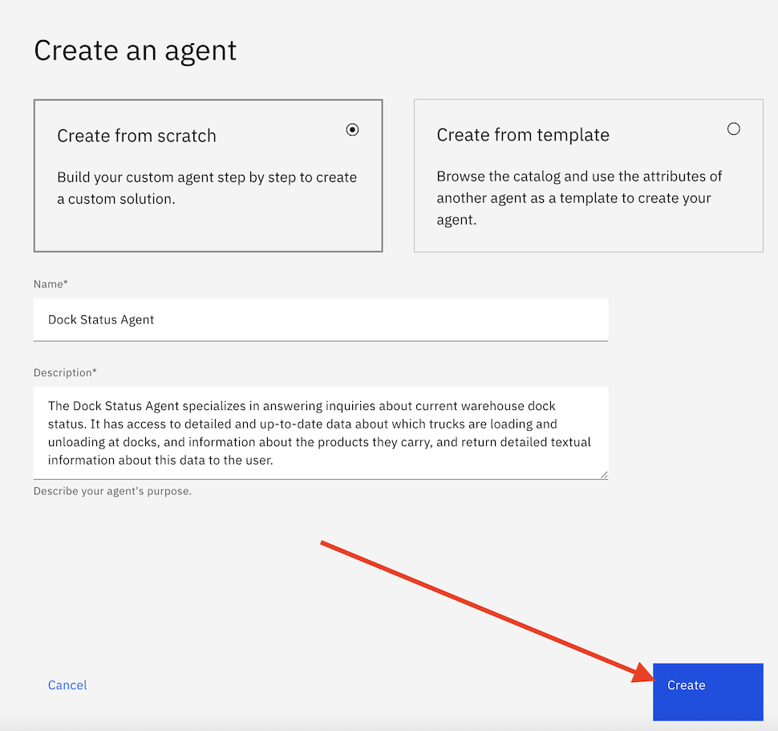
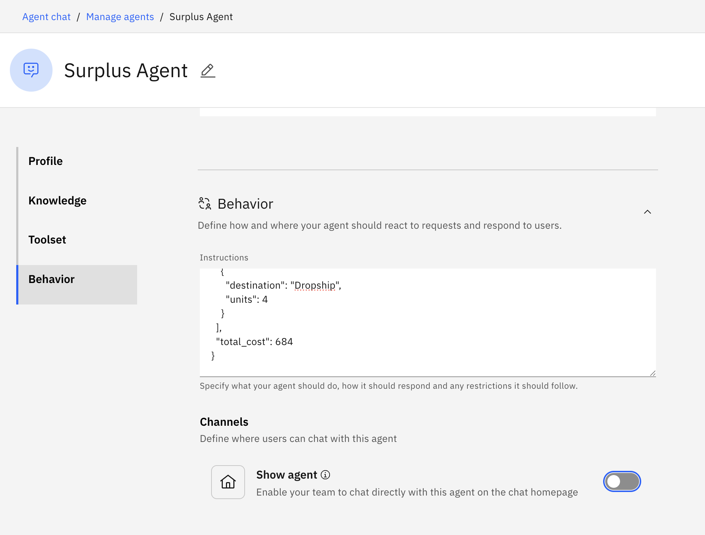
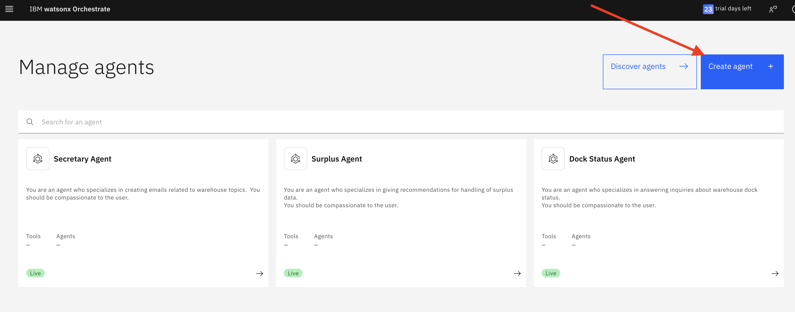
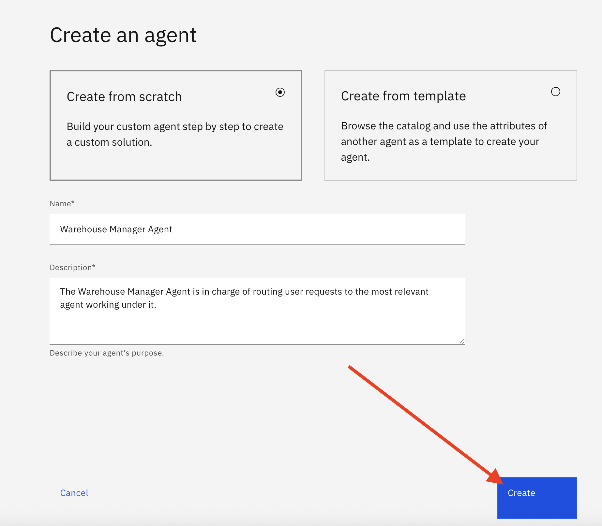
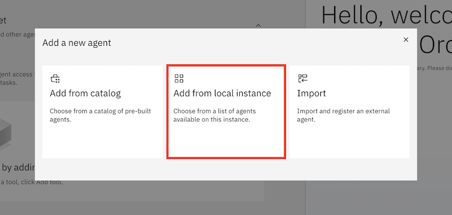
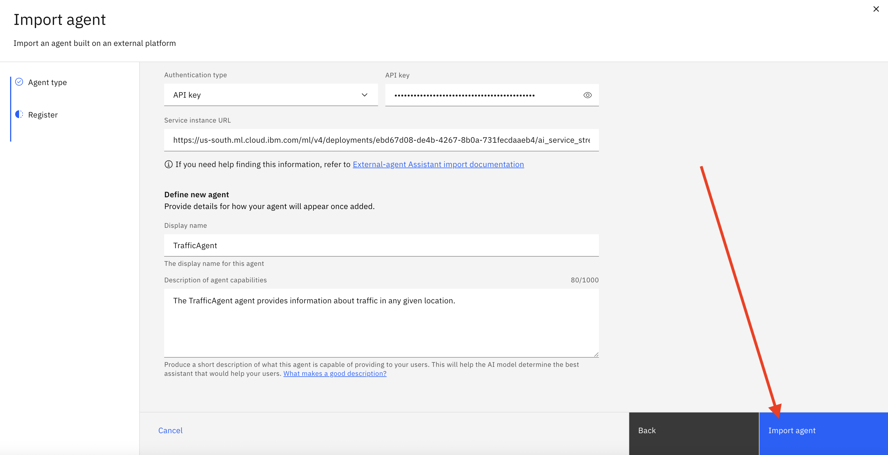
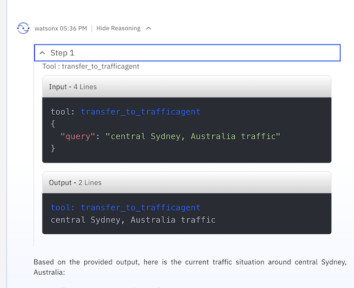
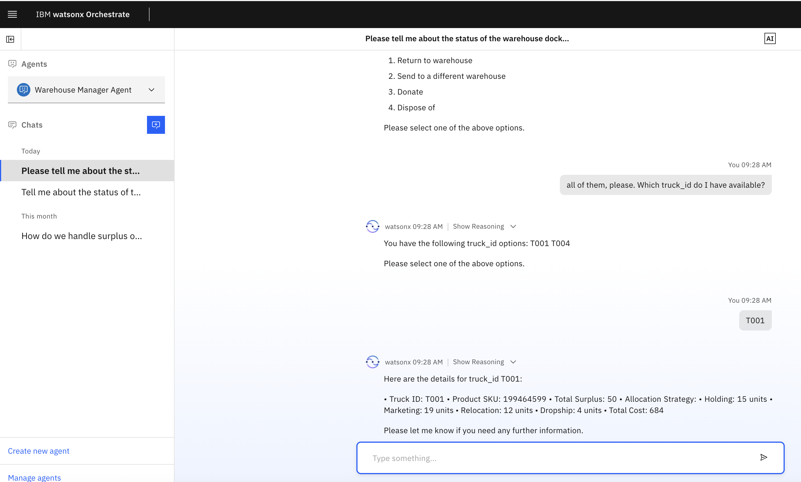

# Caso de Uso: Assistente de IA Inteligente

## Índice

- [Caso de uso: Assistente de IA inteligente](#use-case-intelligent-ai-assistant)
  - [Índice](#table-of-contents)
  - [Introdução](#Introdução)
    - [Pré-requisitos](#Pré-requisitos)
  - [Watsonx Orchestrate](#watsonx-Orchestrate)
    - [O console Watsonx Orchestrate](#O-console-do-watsonx-Orchestrate)
    - [Configuração do Agente AI](#Configuração-do-Agente-de-IA)
    - [O agente de status do Dock](#O-Agente-de-Status-da-Doca)
    - [O Agente Excedente](#O-Agente-de-Excedente)
    - [O agente secretário](#O-Agente-Secretário)
    - [O Agente de Trânsito](#O-Agente-de-Trânsito)
    - [O Agente Gerente de Armazém](#O-Agente-Gerente-de-Armazém)
  - [Resumo](#Resumo)

## Introdução
Este caso de uso descreve um cenário onde um usuário utiliza um agente de IA via chat/interação em linguagem natural para auxiliar na execução de tarefas que exigem a seleção do agente adequado para cada solicitação.
Agentes podem ser configurados no sistema para atender a necessidades específicas da organização.
Each agent, in turn, is connected with a Large Language Model (LLM) that supports function calling, so that it can leverage one or more tools, again based on each tool's description.

No nosso cenário, construiremos agentes para Status da Doca, Manuseio de Excedente, funções de Secretário e informações de Trânsito — todos conectados a um agente roteador.

There is an argument to be made that a truly agentic solution would show a high degree of autonomy. To address a particular problem, or ask, an agentic solution will make a plan, execute this plan, check its effectiveness towards a good outcome, and possibly revise the plan as needed, all in an automated fashion and without human intervention. Applying that to the flow described above, we can simply take out the "human in the loop", by letting the system analyze the status of the dock, decide what to do with surplus product, notify stakeholders of the decision (say, return surplus to original warehouse), and update systems of record. At the same time, we can have a "human in the loop", whereby the Warehouse Manager invokes every step along the way, checking the response from the respective agent to ensure the right progression.

<div style="border: 2px solid black; padding: 10px;">
Embora estejamos apresentando um exemplo completo e funcional, você também deve considerar fazer alterações que se ajustem ao seu caso de uso desejado e usar esta descrição apenas como um ponto de referência para guiá-lo em sua própria implementação.
</div>

### Pré-requisitos

- Verifique com seu instrutor para ter certeza de que **todos os sistemas** estejam funcionando antes de continuar.
- If you're an instructor running this lab, check the **Instructor's guides** to set up all environments and systems.

## watsonx Orchestrate

Conforme mostrado na [Arquitetura da Solução](images/Intelligent%20Assistant%20Architecture.jpeg), Construiremos e implantaremos a maioria dos agentes para a solução no Watsonx Orchestrate.

Para acessar o console do Watsonx Orchestrate, acesse [Lista de recursos na página inicial do IBM Cloud](https://cloud.ibm.com/resources).


Expanda a seção `AI / Machine Learning` e selecione o recurso que possui `watsonx Orchestrate` na coluna Produto, conforme mostrado acima. Em seguida, clique no botão `Launch watsonx Orchestrate`.


Isso abre o console do watsonx Orchestrate.


### O console do watsonx Orchestrate

> Ao abrir o console pela primeira vez, você poderá ser recebido por uma janela pop-up solicitando a criação do seu primeiro agente. Clique em `Skip for now`.


No console, é mostrado que nenhum agente foi implantado ainda. Portanto, se você interagir com o Watsonx Orchestrate neste momento, não acontecerá muita coisa, pois o sistema não tem agentes disponíveis para encaminhar qualquer solicitação.

No entanto, você já pode interagir com o Large Language Model (LLM), que funciona nos bastidores, e fazer perguntas gerais, como "Como você está hoje?" ou "Qual é a capital da França?".



Vá em frente e converse com o watsonx Orchestrate para explorar que tipo de respostas ele dá às suas perguntas.

### Configuração do Agente de IA
Agora estamos prontos para construir o primeiro agente. No console do Watsonx Orchestrate, clique em `Criar ou Implantar` ou `Criar novo agente` (ambos os comandos levarão você ao mesmo lugar).



### O Agente de Status da Doca
Na tela seguinte, você pode selecionar se deseja criar o novo agente do zero ou a partir de um modelo, e atribuir um nome e uma descrição a ele.
Para criar a solução, você precisará criar vários agentes, e nós os analisaremos um por um, começando pelo agente `Status da Doca`. Vamos começar atribuindo um nome e uma descrição:
- Nome: Agente de status de doca
- Descrição:
```
O Agente de Status de Doca é especializado em responder a perguntas sobre o status atual das docas do armazém. Ele tem acesso a dados detalhados e atualizados sobre quais caminhões estão carregando e descarregando nas docas, além de informações sobre os produtos que transportam, e retorna informações textuais detalhadas sobre esses dados ao usuário.
```

Observe que, no mundo dos Agentes de IA, essas descrições não são usadas apenas como documentação, mas também na tomada de decisões sobre a seleção do agente certo para o trabalho. Portanto, o que você inserir neste campo é importante.

Após inserir as informações necessárias, clique em `Create`.



Na tela seguinte, podemos inserir mais informações sobre o novo agente que estamos construindo. Os agentes podem contar com o `Knowledge`, um `Toolset` que consiste em uma ou mais `Tools` e um ou mais `Agents` para atender a uma solicitação enviada a eles, e podemos definir todos esses elementos aqui.
- `Knowledge` representa informações armazenadas na forma de "embeddings" em um chamado Repositório de Vetores. Sempre que o agente responde a uma solicitação, ele pode optar por executar uma pesquisa no repositório de Conhecimento conectado (ou seja, o Repositório de Vetores) para buscar informações que possam auxiliar na resposta à solicitação. Você pode carregar documentos diretamente aqui ou conectar o agente a um repositório já existente. Observe que, mais uma vez, o campo "Descrição" é fundamental, pois ajudará o agente a decidir se deve executar uma pesquisa no conhecimento.
- O `Toolset` contém outros componentes aos quais o agente pode delegar determinadas tarefas.
- `Tools` são funções que um agente pode chamar. Pode ser uma chamada de API ou uma invocação de código personalizado. Isso permite estender a capacidade do agente além daquela com a qual o LLM foi treinado.
- `Agents` são outros agentes, dentro do watsonx Orchestrate ou em execução externa, por exemplo, em watsonx.ai, aos quais este agente pode delegar a solicitação, ou parte de uma solicitação.


Em uma implantação de produção real, o agente Dock Status ficaria em frente a um sistema de backend corporativo existente, capaz de fornecer dados atualizados sobre os caminhões atualmente parados nas docas do armazém e monitorar os produtos e suas quantidades descarregadas.
No entanto, neste exercício prático, simularemos esse backend simplesmente codificando os dados no campo `Behavior` do agente. O conteúdo desse campo direciona os prompts enviados ao LLM subjacente, e adicionar os dados codificados equivale a fornecer exemplos no prompt. Portanto, para simular dados provenientes de um sistema corporativo, podemos usar esta solução alternativa. Observe como as instruções fornecem informações detalhadas sobre a persona e o contexto com o qual este agente opera.

Na página de definição do agente, role até a seção `Behavior` e copie o seguinte texto no campo de texto `Instructions`:

```
Persona:
- Seu objetivo é fornecer informações sobre o status das docas do armazém. Perguntarei sobre o status das docas, ou de uma doca específica identificada pelo ID da doca, e você responderá em um formato de texto detalhado.

Contexto:
- Use os dados de status da doca abaixo para criar respostas. Os dados abaixo são formatados em JSON, mas você retornará as informações como texto em uma lista com marcadores.
- Se nenhum ID de doca for especificado, retorne dados para todas as docas.
- Os dados são atuais, nenhum registro de data e hora é necessário ou suportado.
- Forneça o máximo de detalhes possível.

Dados de status da doca:
```json
{
  "dock_id": 1,
  "trucks": [
    {
      "truck_id": "T001",
      "status": "Descarregando",
      "ETA": "2 horas",
      "details": {
        "SKU": "199464599",
        "Payload_Quantity": 250,
        "Surplus_Status": "Excedente recebido"
      }
    },
    {
      "truck_id": "T002",
      "status": "Descarregando",
      "ETA": "1.5 horas",
      "details": {
        "SKU": "226814212",
        "Payload_Quantity": 150,
        "Surplus_Status": "Sem excedente"
      }
    },
    {
      "truck_id": "T003",
      "status": "Descarregando",
      "ETA": "1 hora",
      "details": {
        "SKU": "404108299",
        "Payload_Quantity": 200,
        "Surplus_Status": "Sem excedente"
      }
    }
  ]
},
{
  "dock_id": 2,
  "trucks": [
    {
      "truck_id": "T004",
      "status": "Descarregando",
      "ETA": "1.5 horas",
      "details": {
        "SKU": "102209199",
        "Payload_Quantity": 50,
        "Surplus_Status": "Received surplus"
      }
    },
    {
      "truck_id": "T005",
      "status": "Descarregando",
      "ETA": "2 horas",
      "details": {
        "SKU": "148183199",
        "Payload_Quantity": 80,
        "Surplus_Status": "Sem excedente"
      }
    }
  ]
}
```


Por fim, certifique-se de desmarcar a caixa de seleção `Show agent`, como mostrado na imagem abaixo. Esta opção controla se o agente estará disponível na janela de bate-papo principal. Queremos expor apenas o agente de nível superior (que ainda não criamos) lá.


Vamos agora testar o novo agente. Na janela de visualização, insira uma pergunta para o agente, por exemplo, "Você pode me informar sobre o status das docas do armazém?". Observe como o agente está usando os dados fornecidos para formular sua resposta.


> Ao fazer isso em sua própria instância, você poderá ver respostas diferentes das mostradas na captura de tela acima. Além disso, o agente frequentemente fará perguntas complementares antes de oferecer uma resposta. Isso se deve à natureza indeterminística dos modelos de IA envolvidos. Sinta-se à vontade para experimentar diferentes tipos de perguntas para ver como o agente reage. O mesmo se aplica a todos os agentes descritos abaixo.

Agora você pode prosseguir e implantar o agente usando o botão `Deploy` no canto superior direito da página.


Agora, vamos voltar para a lista de agentes na página Gerenciar agentes, clicando no link `Manage agents` no canto superior esquerdo da página.


Observe como o Dock Status Agent agora exibe um pequeno ícone verde com a inscrição "Live" (Ativo). Isso indica a implantação bem-sucedida do agente.

### O Agente de Excedente

Este agente analisa opções para o tratamento de produtos excedentes e faz recomendações sobre como lidar com eles. Produtos excedentes podem ser encaminhados para diversos locais, cada um com custos diferentes. Assim como no exemplo anterior, um sistema real seria conectado a uma aplicação separada que realiza essa análise, e aqui vamos apenas simulá-la. Usaremos a mesma abordagem do Agente de Status de Doca, ou seja, adicionar os dados codificados ao campo Behavior.

Na visualização Gerenciar agentes, clique no botão `Create agent`.


Agora deixe a opção `Create from scratch` selecionada, digite "Agente Excedente" como nome e insira o seguinte no campo Descrição:
```
O Agente de Excedentes fornece recomendações sobre o tratamento de dados excedentes. Ele tem acesso a dados como a estratégia de alocação, o SKU do produto e o custo total do excedente em cada caminhão, e retorna informações sobre o tratamento recomendado para o excedente.
```


Clique em `Create`.

Na visualização a seguir, role até a seção `Behavior` e insira o seguinte no campo `Instructions`:
```
Persona:
- Seu objetivo é fornecer informações sobre excedentes. Perguntarei sobre o tratamento recomendado para excedentes em um caminhão específico, e você responderá detalhadamente com a estratégia de alocação com base nos dados fornecidos, juntamente com o ID do caminhão, SKU do produto, custo total e unidade excedente.

Contexto:
- Use os dados de excedentes abaixo para criar respostas. Os dados abaixo são formatados em JSON, mas você retornará as informações como texto em uma lista com marcadores.
- Se nenhuma estratégia de alocação for especificada, retorne os dados de acordo com a estratégia de alocação padrão fornecida nos dados abaixo.
- Se nenhum SKU de produto for fornecido pelo usuário, retorne os dados para todos os SKUs de produtos dentro de um determinado ID de caminhão.
- Forneça o máximo de detalhes possível.

Dados de excedentes:
```json
{
  "truck_id": "T004",
  "SKU": "102209199",
  "total_surplus": 15,
  "allocation": [
    {
      "destination": "Marketing",
      "units": 12
    },
    {
      "destination": "Mudança",
      "units": 3
    }
  ],
  "total_cost": 69
},
{
  "truck_id": "T001",
  "SKU": "199464599",
  "total_surplus": 50,
  "allocation": [
    {
      "destination": "Contenção",
      "units": 15
    },
    {
      "destination": "Marketing",
      "units": 19
    },
    {
      "destination": "Mudança",
      "units": 12
    },
    {
      "destination": "Dropship",
      "units": 4
    }
  ],
  "total_cost": 684
}
```

Desmarque a caixa de seleção Mostrar agente, assim como você fez para o agente Status do Dock.



Antes de implantar este novo agente, podemos testar sua funcionalidade inserindo solicitações na janela de visualização. Por exemplo, você pode perguntar:
```
Como lidamos com o excedente do caminhão T001?
```


Quando estiver satisfeito com o resultado, clique no botão `Deploy` para implantar este agente e, em seguida, clique no link `Manage Agents` para retornar à página de visão geral dos agentes.

Agora você deverá ver dois agentes listados, e ambos deverão ter o indicador "Ativo".


### O Agente Secretário

Criar mais um agente deve ser muito fácil para você agora! Queremos um agente que gerencie a comunicação com as partes interessadas, incluindo o envio de notificações sobre o processamento de excedentes. O processo será exatamente o mesmo dos dois agentes anteriores, e mais uma vez forneceremos exemplos de saída no campo "Instruções".

Clique em Criar agente e insira o seguinte:
- Name: Agente Secretário
- Description: 
```
O Agente Secretário é especializado na criação de e-mails relacionados a tópicos de depósito.
```

Em seguida, clique em Criar e adicione o seguinte texto ao campo `Instructions` na seção Comportamento:
```
Persona:
Sua persona é a de uma secretária que redige e-mails. Pedirei que você crie um e-mail sobre um tópico específico e você retornará um rascunho textual desse e-mail.

Contexto:
- Escreva um rascunho de e-mail conciso e profissional sobre o excedente no estoque. O e-mail deve começar diretamente com o assunto, seguido pelo corpo do e-mail, sem nenhuma declaração introdutória ou preâmbulo.
- Use seu conhecimento em redação de e-mails como um guia para estrutura e tom, mas não se limite a equipes específicas ou exemplos predefinidos.
- Presuma que o público e o conteúdo são gerais, a menos que especificado de outra forma.
- Evite mencionar quaisquer limitações de conhecimento ou fazer referência a equipes específicas, a menos que seja explicitamente necessário.
- Abaixo estão exemplos de prompts de usuário e o e-mail gerado como orientação para suas próprias gerações.
Exemplos:
Exemplo 1:
Entrada:
Gerar um e-mail de notificação para a equipe de marketing para o item 223456789 com 25 unidades
Saída:
Assunto: Notificação de Unidades Excedentes para o SKU nº 223456789

Equipe de Marketing,
Este e-mail é para informar que há 25 unidades excedentes do item 223456789 disponíveis. Por favor, revise e coordene quaisquer esforços de marketing necessários para essas unidades adicionais.

Gerenciamento de Armazém

Exemplo 2:
Entrada: Gerar um e-mail de notificação para a equipe de estoque para o item 112334343 com 10 unidades
Saída:

Assunto: Notificação de Unidades Excedentes para o SKU nº 112334343

Equipe de Estoque,
Este e-mail é para notificá-lo de que há 10 unidades do item 112334343 em estoque que precisam ser armazenadas no estoque. Por favor, tome as medidas necessárias.

Gestão de Armazém

Exemplo 3:
Entrada: Gerar um e-mail de notificação para a equipe de dropshipping para o SKU: 88245464599 de 10 unidades
Saída:
Assunto: Notificação de Unidades Excedentes para o SKU nº 88245464599

Equipe de Dropshipping,
Este e-mail é para notificá-los de que há 10 unidades do item 88245464599 em excesso. Revise e ajuste os cronogramas de envio conforme necessário para acomodar essas unidades adicionais.

Gestão de Armazém

Exemplo 4:
Entrada: Gerar um e-mail de notificação para a equipe de realocação para o SKU: 765004599 de 9 unidades
Saída:
Assunto: Notificação de Unidades Excedentes para o SKU nº 765004599

Equipe de Realocação,
Este e-mail é para notificá-los de que há 9 unidades do item 765004599 em excesso. Por favor, revise e coordene quaisquer esforços de realocação necessários para essas unidades adicionais.

Gerenciamento de Armazém
```

Desmarque a opção `Show agent`. Em seguida, teste o novo agente com a Visualização, por exemplo, insira "Gerar um e-mail de notificação para a equipe de marketing para o SKU: 8932464599 de 10 unidades". O resultado deve ser semelhante ao da imagem abaixo.


Certifique-se de clicar no botão `Deploy` novamente e retornar à janela de visão geral do agente clicando no link `Manage agents` no canto superior esquerdo da janela.

### O Agente de Trânsito

Quase lá! Para este agente, precisamos recuperar informações de tráfego atualizadas sobre um determinado local. Para isso, delegaremos o trabalho a um agente desenvolvido usando código Python e o framework LangGraph, implantado em watsonx.ai. A criação deste agente não é assunto deste laboratório, mas será abordada em um laboratório separado no futuro.
Aqui, você receberá os detalhes do agente do seu instrutor, que o pré-implantou para você. Portanto, não há mais nada a fazer por enquanto.

### O Agente Gerente de Armazém

Finalmente estamos prontos para criar o agente que atua como orquestrador de todos os outros agentes e é o agente com o qual o usuário final interage.

Clique em `Create agent` mais uma vez.



Assim como os outros agentes que você já criou, este será criado do zero. O nome é "Agente Gerente de Armazém". A descrição difere dos agentes anteriores, indicando que este é um agente "orquestrador", "supervisor" ou "roteador":
```
O Agente Gerente de Armazém é responsável por encaminhar as solicitações dos usuários para o agente mais relevante que trabalha sob sua responsabilidade.  Ele é cortês e sempre responde no idioma portugues do Brasil.
``` 

Após inserir as informações, clique em `Create`.



Mencionamos acima que um agente pode colaborar com outros agentes para realizar uma tarefa específica. Você insere esses agentes colaboradores na seção `Agents`, em `Toolset`, na janela de definição do agente.


Clique no botão `Add agent`. Como queremos adicionar os agentes que você criou acima como colaboradores a este agente, selecione a opção `Add from local instance`.



Aqui você vê todos os três agentes listados que você criou. Queremos que todos eles sejam usados ​​pelo Agente do Gerente de Armazém, então marque cada um deles e clique em `Add to agent`. Observe que é possível que você veja mais do que os três agentes abordados neste laboratório (você pode ter criado agentes de um laboratório diferente ou criado alguns dos seus próprios), portanto, certifique-se de selecionar o conjunto correto de três.


Mas ainda não terminamos. Clique em `Add agent` novamente. Desta vez, selecione a opção "Import". Isso nos permitirá importar o agente de watsonx.ai.


On the next screen, select the `External agent` option and click on `Next`.
Na próxima tela, selecione a opção `External agent` e clique em `Next`.


On the following screen, enter details about the imported agent:
- Agent details
  - Provider: `watsonx.ai`
  - Authentication type: deixe `API key`
  - API key: digite a chave fornecida a você pelo seu instrutor
  - URL da instância do serviço: insira o valor fornecido pelo seu instrutor
- Definir novo agente
- Nome de exibição:`AgenteDeTrafego` (o nome não pode conter espaço)
  - Descrição: `O agente TrafficAgent fornece informações sobre o tráfego em qualquer local.`



Agora clique em `Import agent`. Você deverá ver todos os quatro agentes listados na seção Conjunto de ferramentas do Agente do Warehouse Manager.


Por fim, damos a este agente instruções sobre como usar os agentes colaboradores que definimos anteriormente. Insira o seguinte texto no campo `Instructions`, em Behavior.
```
Justificativa:
- Utilize o Agente de Status de doca para tarefas relacionadas ao status da doca.
- Utilize o Agente Excedente para tarefas relacionadas ao excedente.
- Utilize o Agente Secretário para redigir e-mails.
- Utilize o AgenteDeTrafego para encontrar informações de trânsito sobre um local.
```

Antes de testar este agente, role a tela até o final e verifique se a caixa de seleção `Show agent` está realmente marcada! Este é o agente que queremos usar na janela de bate-papo principal e disponibilizá-lo aos usuários finais.


Vamos testar. Como ainda não o abordamos, vamos começar com o agente externo TrafficAgent. Podemos acioná-lo perguntando sobre o trânsito em um determinado local, digamos, Sydney, Austrália. Digite o seguinte na entrada de texto de visualização: "Informe-me sobre o trânsito no centro de Sydney, Austrália." (Você também pode escolher qualquer outro local, é claro.)


Observe que o agente estava "raciocinando", ou seja, determinando como responder a essa solicitação. Ele decidiu que encaminhar a solicitação para o TrafficAgent era a melhor opção. Você pode expandir a seção `Show reasoning` na Visualização e ver quais etapas o agente realizou. Ela deve listar uma etapa, que você também pode expandir.



Observe como ele selecionou o agente de Tráfego para responder à solicitação, o que obviamente foi a escolha certa neste caso.

Agora você pode testar o roteamento para os outros agentes, possivelmente usando os mesmos prompts ou prompts semelhantes aos que você usou anteriormente para testá-los individualmente:
- "Qual é o status das docas do armazém?"
- "Como lidamos com o excedente do caminhão T001?"
- "Crie um e-mail de notificação..."
  


Once you are satisfied with the answer, deploy this agent using the `Deploy` button as with the other agents before. Since we left the `Show agent` option checked, we can now go back to the home screen to see it there. Simply click on `watsonx Orchestrate` at the very top of the window.
Quando estiver satisfeito com a resposta, implante este agente usando o botão `Deploy`, como fez com os outros agentes anteriores. Como deixamos a opção `Show agent`  marcada, agora podemos retornar à tela inicial para vê-lo. Basta clicar em `watsonx Orchestrate` no topo da janela.


Agora você pode inserir suas perguntas e solicitações na janela principal de bate-papo. Observe que o agente Gerente de Armazém já está pré-selecionado na lista de Agentes à esquerda (de qualquer forma, é o único agente que aparece nessa lista). Você pode usar as mesmas perguntas que fez ao testar os agentes individuais acima.
 


Incentivamos você a explorar mais o comportamento da solução, fazendo perguntas mais "carregadas", que envolvam mais de um agente para responder. Por exemplo, você pode perguntar "Por favor, me informe sobre o status das docas do armazém e me diga o que fazer com o excedente, se houver". Observe como o agente pode lhe fazer perguntas de esclarecimento subsequentes para obter informações mais específicas, por exemplo, sobre qual ID exata do caminhão você está perguntando.
O que isso tenta mostrar é como você pode enviar perguntas e instruções bastante detalhadas a um agente, mas também pode dar a ele mais autonomia para atender a uma solicitação, envolvendo vários agentes e ferramentas.



Parabéns! Você criou uma solução completa de IA agêntica, sem escrever uma única linha de código!

## Resumo

Neste laboratório, analisamos o caso de uso de um gerente operacional em um armazém, que utiliza uma solução agêntica para lidar com produtos que chegam e possivelmente excedentes. Começamos criando vários agentes para tarefas como recuperação do status da doca ou análise de excedentes. Para começar, importamos um agente externo em execução em watsonx.ai. Por fim, tudo isso foi reunido no agente de orquestração que serve como frontend principal.

Depois de configurarmos tudo para ser usado pelo chat do Agente de IA, podemos interagir com a solução por meio da interface principal do chat, e o sistema executará e delegará ao agente apropriado.

Observe que a intenção deste exercício é fornecer um ponto de partida. Algumas partes desta solução são simuladas e precisariam ser totalmente implementadas para uma solução real. Além disso, uma solução verdadeiramente agêntica adicionaria uma camada de raciocínio sobre o que você construiu aqui, o que permite elaborar um plano para lidar, neste caso, com a situação do armazém de forma autônoma, tomando suas próprias decisões ao longo do caminho. Acreditamos que essas soluções ainda não se tornaram realidade.

Mas espero que isso tenha lhe gerado algumas ideias sobre como aproveitar agentes de IA no seu ambiente de negócios.